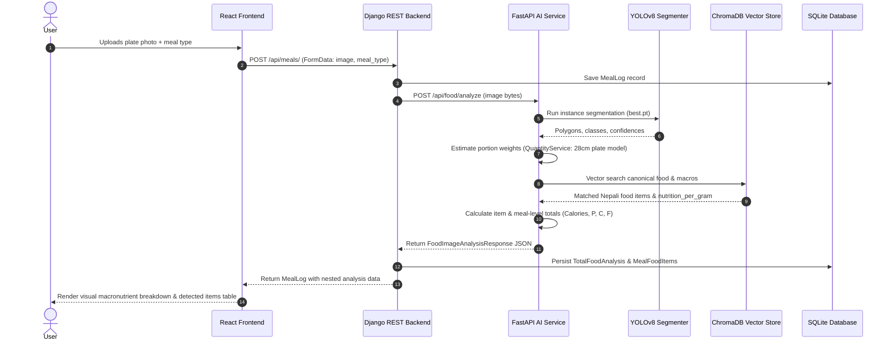
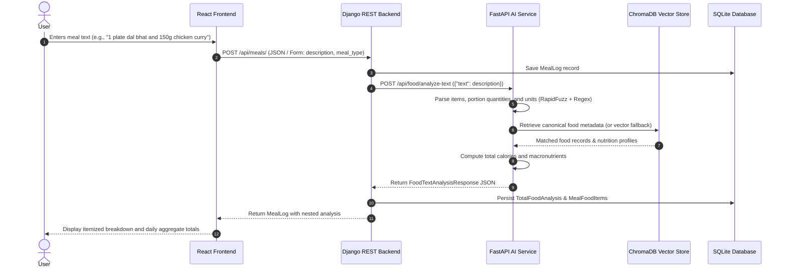
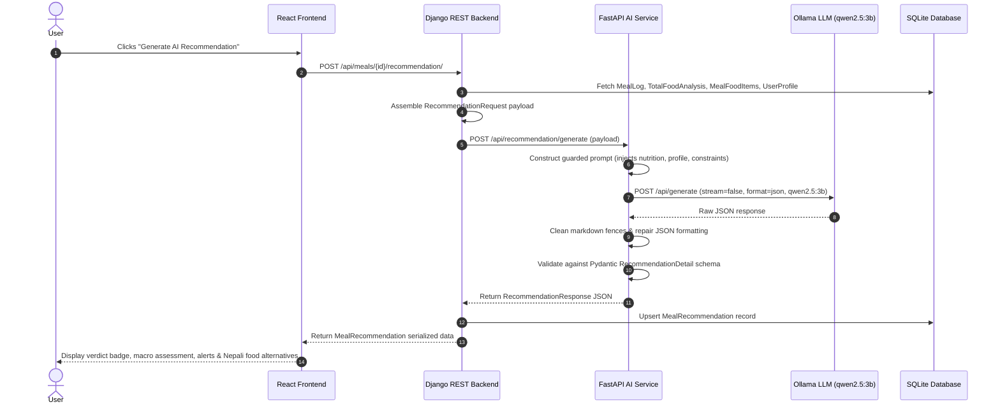

# Nepali Lifestyle-Based Diet and Fitness Advisory System

[](https://www.python.org/)
[](https://www.djangoproject.com/)
[](https://fastapi.tiangolo.com/)
[](https://react.dev/)
[](https://vitejs.dev/)
[](https://tailwindcss.com/)
[](https://github.com/ultralytics/ultralytics)
[](https://www.trychroma.com/)
[](https://ollama.com/)

An AI-powered personalized diet and fitness advisory platform tailored specifically for Nepali cuisine, lifestyle patterns, and nutritional requirements. The system analyzes meal plate photos and natural language descriptions to identify indigenous dishes, estimate portion sizes, calculate macronutrient values, and deliver actionable dietary advice aligned with individual health profiles, fitness goals, and medical conditions.

---

## Table of Contents

- [Overview](#overview)
- [System Architecture](#system-architecture)
- [Core Workflows](#core-workflows)
  - [1. Image-Based Meal Analysis Flow](#1-image-based-meal-analysis-flow)
  - [2. Text-Based Meal Analysis Flow](#2-text-based-meal-analysis-flow)
  - [3. AI Recommendation Flow](#3-ai-recommendation-flow)
- [Key Architectural Invariants](#key-architectural-invariants)
- [Technology Stack](#technology-stack)
- [Backend Data Models & Components](#backend-data-models--components)
- [AI / ML Subsystems](#ai--ml-subsystems)
- [API Endpoints](#api-endpoints)
  - [Django REST Backend (`:8000`)](#django-rest-backend-8000)
  - [FastAPI AI Service (`:8001`)](#fastapi-ai-service-8001)
- [Repository Structure](#repository-structure)
- [Local Development Setup](#local-development-setup)
  - [Prerequisites](#prerequisites)
  - [1. Clone Repository](#1-clone-repository)
  - [2. Python Environment & Dependencies](#2-python-environment--dependencies)
  - [3. Build the ChromaDB Vector Store](#3-build-the-chromadb-vector-store)
  - [4. Django Migrations](#4-django-migrations)
  - [5. Frontend Setup](#5-frontend-setup)
  - [6. Ollama Local LLM Setup](#6-ollama-local-llm-setup)
  - [7. Running the Full System](#7-running-the-full-system)
- [Environment Configuration](#environment-configuration)
- [Authors & Academic Context](#authors--academic-context)

---

## Overview

Mainstream dietary tracking platforms are largely calibrated around Western dietary habits and generic food databases. They lack representation for Nepali dishes (*Dal Bhat*, *Gundruk*, *Dhindo*, *Chiura*, *Tarkari*, *Achar*), fail to accommodate cultural and religious eating habits (such as *vrat* fasting or vegetarian restrictions), and impose high friction through manual ingredient search.

The **Nepali Lifestyle-Based Diet and Fitness Advisory System** addresses these challenges via an integrated multi-service architecture:
- **Visual Food Analysis**: Utilizes a fine-tuned YOLOv8 instance segmentation model to detect individual dishes from top-down plate photos.
- **Portion Weight Estimation**: Calculates food portion weights using a 28 cm plate diameter pixel-to-metric geometric model factoring in density and dish shapes.
- **Semantic Food Matching**: Maps localized/colloquial food names to canonical nutritional records using ChromaDB vector similarity search with multilingual sentence embeddings.
- **Natural Language Text Parsing**: Extracts items and portion units from conversational Nepali/English food logs using fuzzy matching and regex parsing.
- **Personalized Dietary Advisory**: Synthesizes nutritional profiles with user health metrics, allergies, and fitness targets via a local LLM (Ollama `qwen2.5:3b`) with strict schema validation.

---

## System Architecture

The application is structured into four decoupled, specialized layers:

```
+-------------------------------------------------------------+
|                      React Frontend                         |
|           (Vite + React 19 + Tailwind CSS v4)               |
+------------------------------+------------------------------+
                               |  HTTP (Axios + JWT Auth)
                               v
+-------------------------------------------------------------+
|                   Django REST Backend                       |
|     - Authentication & Session Management (CustomUser)      |
|     - User Health Profiles, Conditions, Allergies           |
|     - Meal Logs & Media Storage (meal_photos/)              |
|     - Persistence: TotalFoodAnalysis, MealFoodItems         |
|     - Persistence: MealRecommendation                       |
|     - SQLite Development Database (db.sqlite3)              |
+------------------------------+------------------------------+
                               |  HTTP Client (httpx)
                               v
+-------------------------------------------------------------+
|                   FastAPI AI Service                        |
|  +---------------------+  +-------------------------------+ |
|  | Image Pipeline      |  | Text Pipeline                 | |
|  | - YOLOv8 (best.pt)  |  | - Alias Index & RapidFuzz     | |
|  | - Quantity Model    |  | - Quantity Unit Parsing       | |
|  +----------+----------+  +---------------+---------------+ |
|             |                             |                 |
|             +--------------+--------------+                 |
|                            v                                |
|             +-------------------------------+               |
|             | ChromaDB Vector Store         |               |
|             | (nepali_foods Collection)     |               |
|             | multilingual-MiniLM-L12-v2    |               |
|             +--------------+----------------+               |
|                            |                                |
|                            v                                |
|             +-------------------------------+               |
|             | Recommendation Engine         |               |
|             | - Context Prompt Constructor  |               |
|             | - Ollama (qwen2.5:3b)         |               |
|             | - JSON Repair & Sanitization  |               |
|             | - Pydantic Validation         |               |
|             +-------------------------------+               |
+-------------------------------------------------------------+
```

---

## Core Workflows

### 1. Image-Based Meal Analysis Flow



### 2. Text-Based Meal Analysis Flow



### 3. AI Recommendation Flow



---

## Key Architectural Invariants

1. **Separation of Source of Truth**:
   - Nutritional values computed by the food analysis pipeline are persisted by Django in `TotalFoodAnalysis` and `MealFoodItems`.
   - The LLM recommendation layer **never recalculates nutritional values**. It receives the persisted macro totals as immutable input and focuses solely on contextual evaluation, clinical/lifestyle alignment, and culturally authentic food suggestions.
2. **Client Isolation**:
   - The React frontend communicates strictly with Django. It does not invoke FastAPI directly.
   - Django handles authentication, user authorization, multi-table context aggregation, and transactional database persistence.
3. **Graceful Pipeline Decoupling**:
   - If AI recommendation generation is delayed or unavailable, the nutritional analysis remains fully accessible and queryable.

---

## Technology Stack

### Frontend
- **Framework**: [React 19](https://react.dev/) (`react@^19.2.8`, `react-dom@^19.2.8`)
- **Build Tool**: [Vite 8](https://vitejs.dev/) (`vite@^8.2.0`, `@vitejs/plugin-react@^6.0.4`)
- **Styling**: [Tailwind CSS v4](https://tailwindcss.com/) (`@tailwindcss/vite@^4.3.3`, `tailwindcss@^4.3.3`)
- **Routing**: [React Router DOM v7](https://reactrouter.com/) (`react-router-dom@^7.18.2`)
- **Form Management**: [React Hook Form](https://react-hook-form.com/) (`react-hook-form@^7.85.0`)
- **HTTP Client**: [Axios](https://axios-http.com/) (`axios@^1.19.0`) with request interceptor for JWT authorization and response interceptor for automatic token refresh.

### Backend
- **Language & Runtime**: Python 3.12+ (Package management via [`uv`](https://docs.astral.sh/uv/))
- **Web Framework**: [Django 6.0](https://www.djangoproject.com/) (`django>=6.0.6`)
- **API Framework**: [Django REST Framework](https://www.django-rest-framework.org/) (`djangorestframework>=3.17.1`)
- **Authentication**: [DRF SimpleJWT](https://django-rest-framework-simplejwt.readthedocs.io/) (`djangorestframework-simplejwt>=5.5.1`)
- **CORS Handling**: `django-cors-headers>=4.9.0`
- **HTTP Client**: [HTTPX](https://www.python-httpx.org/) (`httpx>=0.28.1`) for asynchronous and synchronous calls to the FastAPI AI service
- **Database**: SQLite (`db.sqlite3`) for local development

### AI & ML Service
- **Service Framework**: [FastAPI](https://fastapi.tiangolo.com/) (`fastapi[standard]>=0.141.1`) with ASGI server Uvicorn
- **Data Validation**: [Pydantic v2](https://docs.pydantic.dev/) for strict request/response data schemas
- **Computer Vision**: Fine-tuned [YOLOv8 Segmentation](https://github.com/ultralytics/ultralytics) (`ultralytics>=8.4.121`), OpenCV (`opencv-python>=5.0.0`), Pillow (`pillow>=12.2.0`), NumPy (`numpy>=2.5.0`)
- **Vector Database**: [ChromaDB](https://www.trychroma.com/) (`chromadb>=1.5.9`, `langchain-chroma>=1.1.0`)
- **Embedding Model**: `sentence-transformers/paraphrase-multilingual-MiniLM-L12-v2` (`sentence-transformers>=6.0.0`, `langchain-huggingface>=1.2.2`)
- **Fuzzy Text Search**: [RapidFuzz](https://github.com/maxbachmann/RapidFuzz) (`rapidfuzz>=3.14.5`)
- **LLM Engine**: [Ollama](https://ollama.com/) local inference running `qwen2.5:3b` with forced JSON formatting and prompt constraints.

---

## Backend Data Models & Components

The Django backend is modularized across four core domain applications:

```
backend/apps/
├── accounts/      # Identity, registration, authentication & JWT
├── profiles/      # User physical attributes, health goals & dietary restrictions
├── nutritiion/    # Canonical Nepali food database and aliases
└── meals/         # Meal logs, nutritional analysis records & AI recommendations
```

### Key Models

| App | Model | Description |
|---|---|---|
| `accounts` | `CustomUser` | Inherits `AbstractBaseUser` and `PermissionsMixin`. Uses `email` as primary `USERNAME_FIELD`. |
| `profiles` | `UserProfile` | One-to-one with `CustomUser`. Stores `age`, `gender`, `height_cm`, `weight_kg`, `target_weight_kg`, `activity_level`, `fitness_goal`, `dietary_preference`. |
| `profiles` | `MedicalCondition` | Master lookup for health conditions (e.g., Diabetes, Hypertension, Uric Acid) linked to profiles via M2M. |
| `profiles` | `Allergy` | Master lookup for allergies (e.g., Peanuts, Lactose) linked to profiles via M2M. |
| `profiles` | `DietaryRestriction` | Master lookup for religious/social constraints (e.g., Vrat / Fasting, Halal) linked to profiles via M2M. |
| `nutritiion` | `FoodItem` | Canonical reference foods with nutritional macros per 100g (`calories_per_100g`, `protein_per_100g`, `carbs_per_100g`, `fat_per_100g`, `fiber_per_100g`). |
| `nutritiion` | `FoodAlias` | Colloquial and regional aliases associated with a `FoodItem` (e.g., "bhat", "chamal" -> "Cooked Rice"). |
| `meals` | `MealLog` | Primary user meal entry. Stores `meal_type` (`BREAKFAST`, `LUNCH`, `DINNER`, `SNACK`), `description`, and `image` file reference. |
| `meals` | `TotalFoodAnalysis` | One-to-one with `MealLog`. Persists aggregated macronutrient totals (`total_calories`, `total_protein`, `total_carbs`, `total_fats`). |
| `meals` | `MealFoodItems` | ForeignKey to `TotalFoodAnalysis`. Represents itemized food components (`food_name`, `food_quantity`, `food_quantity_unit`, `food_calories`, `food_protein`, `food_carbs`, `food_fats`). |
| `meals` | `MealRecommendation` | One-to-one with `MealLog`. Stores LLM advisory output (`overall_verdict`, `summary`, `macro_assessment`, `health_and_dietary_alerts`, `actionable_suggestions`, `alternative_foods`, `model_name`, `generated_at`). |

---

## AI / ML Subsystems

### 1. YOLOv8 Instance Segmentation (`YOLOService`)
- **Model File**: `ai-service/models/yolo/best.pt`
- **Role**: Detects individual food boundaries on a plate image and outputs binary segmentation masks, bounding boxes, class labels, and detection confidence scores (confidence threshold: `0.25`).

### 2. Geometrical Quantity Modeling (`QuantityService`)
- **Plate Normalization**: Assumes a standard household plate diameter of `28.0 cm`. Computes physical area ($cm^2$) from mask pixel coverage using the image bounding dimensions.
- **Volumetric Modeling**: Applies shape profiles (dome vs. cylinder vs. flat) and food densities ($g/cm^3$) to estimate food portion weights in grams.
  - Rice (*Bhat*): Density `0.75 g/cm³`, dome shape factor `0.6`
  - Lentil Soup (*Dal*): Density `1.05 g/cm³`, cylinder shape factor `1.0`
  - Vegetables (*Sabji*): Density `0.90 g/cm³`, flat shape factor `1.0`

### 3. ChromaDB Vector Matching (`FoodMatchingService`)
- **Storage**: Persistent SQLite vector store located at `ai-service/chroma_db` under collection `nepali_foods`.
- **Embedding Model**: `sentence-transformers/paraphrase-multilingual-MiniLM-L12-v2`.
- **Role**: Encodes food names and aliases into semantic vector space. Maps detected YOLO labels or query strings to canonical food IDs, retrieving macro coefficients, health restrictions, and dietary notes.

### 4. Text Food Extraction (`TextFoodAnalysisService`)
- **Alias Indexing**: Preloads full alias tables and matches natural language input strings by phrase length descending.
- **Fuzzy Token Matching**: Uses `RapidFuzz` (`fuzz.ratio >= 82`) to capture minor spelling variations in Romanized Nepali.
- **Portion Parsing**: Regex extraction for metric units (`grams`, `kg`), household utensils (`plates`, `bowls`, `katora`, `cups`, `glasses`), and item counts (`pieces`, `rotis`).

### 5. Local LLM Recommendation Engine (`RecommendationService`)
- **Backend**: Ollama running locally at `http://localhost:11434`.
- **Default Model**: `qwen2.5:3b` (configurable via `OLLAMA_MODEL`).
- **Inference Constraints**: `temperature: 0.2`, `format: "json"`, max token prediction limit.
- **Sanitization**: Automatic code fence stripping, JSON bracket repair for truncated streams, and Pydantic validation via `RecommendationDetail`.

---

## API Endpoints

### Django REST Backend (`:8000`)

#### Authentication (`apps.accounts`)
| Method | Endpoint | Auth | Purpose |
|---|---|---|---|
| `POST` | `/api/accounts/register/` | Public | Register new user account; returns access and refresh JWT tokens. |
| `POST` | `/api/accounts/login/` | Public | Authenticate user credentials; returns JWT tokens and user details. |
| `POST` | `/api/token/` | Public | Standard DRF SimpleJWT token generation. |
| `POST` | `/api/token/refresh/` | Public | Refresh expired access token using valid refresh token. |

#### User Profile (`apps.profiles`)
| Method | Endpoint | Auth | Purpose |
|---|---|---|---|
| `GET` | `/api/profiles/user-profile/` | JWT | Retrieve current user's profile and health metrics. |
| `POST` | `/api/profiles/user-profile/` | JWT | Create initial user health and lifestyle profile. |
| `PATCH` | `/api/profiles/user-profile/` | JWT | Partially update user profile fields and metrics. |
| `GET` | `/api/profiles/medical-conditions/`| JWT | List master medical conditions for profile selection. |
| `GET` | `/api/profiles/allergies/` | JWT | List master allergy options. |
| `GET` | `/api/profiles/dietary-restrictions/`| JWT | List master dietary/fasting restrictions. |

#### Meal Management & Advisory (`apps.meals`)
| Method | Endpoint | Auth | Purpose |
|---|---|---|---|
| `GET` | `/api/meals/` | JWT | List all meal logs for the authenticated user, including nested analysis. |
| `POST` | `/api/meals/` | JWT | Create a meal entry (`image` or `description`) and automatically trigger AI analysis. |
| `GET` | `/api/meals/<id>/` | JWT | Retrieve specific meal log details, including nutritional analysis and recommendations. |
| `PATCH` | `/api/meals/<id>/` | JWT | Update meal log description or photo (re-triggers analysis). |
| `DELETE`| `/api/meals/<id>/` | JWT | Delete a meal log and its associated analysis and recommendations. |
| `POST` | `/api/meals/<id>/analyze/` | JWT | Manually trigger or re-run nutritional analysis via FastAPI. |
| `GET` | `/api/meals/<id>/recommendation/`| JWT | Fetch existing AI recommendation for the meal. |
| `POST` | `/api/meals/<id>/recommendation/`| JWT | Trigger AI recommendation generation via FastAPI/Ollama and persist result. |

#### Nutrition Reference (`apps.nutritiion`)
| Method | Endpoint | Auth | Purpose |
|---|---|---|---|
| `GET` | `/api/nutrition/foods/` | JWT | Search and list active food items and aliases (`?search=...`). |
| `GET` | `/api/nutrition/foods/<id>/` | JWT | Retrieve canonical food item nutrition details. |

---

### FastAPI AI Service (`:8001`)

| Method | Endpoint | Request Body | Response Model | Description |
|---|---|---|---|---|
| `GET` | `/health` | None | `{"status": "healthy", ...}` | AI service health check. |
| `POST` | `/api/food/analyze` | `multipart/form-data` (`image` file) | `FoodImageAnalysisResponse` | Performs YOLO segmentation, weight estimation, ChromaDB lookup, and macro aggregation. |
| `POST` | `/api/food/analyze-text` | `{"text": string}` | `FoodTextAnalysisResponse` | Extracts dishes and quantities from natural language text and calculates total macros. |
| `POST` | `/api/recommendation/generate` | `RecommendationRequest` JSON | `RecommendationResponse` | Builds guarded prompt, queries Ollama, cleans JSON, and returns structured dietary advice. |

---

## Repository Structure

```
Nepali-Diet-Advisory-System/
├── pyproject.toml               # Python project configuration & unified dependency declarations
├── uv.lock                      # Exact lockfile for Python dependencies
├── .python-version              # Python version pin (3.12)
├── README.md                    # System documentation
├── workflow.md                  # Detailed architectural and implementation guide
│
├── backend/                     # Django REST Framework Backend Application
│   ├── manage.py                # Django administrative command utility
│   ├── db.sqlite3               # Development SQLite database
│   ├── config/                  # Project configuration root
│   │   ├── settings.py          # Django settings (JWT, CORS, AI_SERVICE_URL, Installed Apps)
│   │   ├── urls.py              # Root URL router
│   │   ├── asgi.py              # ASGI entrypoint
│   │   └── wsgi.py              # WSGI entrypoint
│   ├── core/                    # Core shared services
│   │   └── ai_service/
│   │       └── client.py        # HTTP client communicating with FastAPI service
│   ├── media/                   # Uploaded media storage
│   │   └── meal_photos/         # User uploaded meal plate photos
│   └── apps/                    # Django modular applications
│       ├── accounts/            # CustomUser model, managers, JWT auth views & serializers
│       ├── profiles/            # UserProfile, MedicalCondition, Allergy, DietaryRestriction
│       ├── nutritiion/          # FoodItem and FoodAlias database models & search views
│       └── meals/               # MealLog, TotalFoodAnalysis, MealFoodItems, MealRecommendation
│
├── ai-service/                  # FastAPI AI & Machine Learning Microservice
│   ├── app/
│   │   ├── main.py              # FastAPI application entrypoint and health route
│   │   ├── api/
│   │   │   └── routes/
│   │   │       ├── food.py      # /api/food/analyze & /api/food/analyze-text routes
│   │   │       └── recommendation.py # /api/recommendation/generate route
│   │   ├── schemas/             # Pydantic data schemas
│   │   │       ├── food.py      # Image & text analysis request/response schemas
│   │   │       └── recommendation.py # Recommendation contract and JSON schemas
│   │   └── services/            # Core AI domain services
│   │       ├── yolo_service.py  # YOLOv8 model loading & inference wrapper
│   │       ├── quantity_service.py # 28cm plate geometric portion & weight estimation
│   │       ├── food_matching_service.py # ChromaDB vector similarity matching
│   │       ├── image_food_analysis_service.py # End-to-end image analysis orchestrator
│   │       ├── text_food_analysis_service.py  # Natural language text parsing orchestrator
│   │       └── recommendation_service.py     # Ollama prompt construction & JSON validation
│   ├── data/
│   │   └── master_database.json # Master Nepali food nutrition records & metadata
│   ├── chroma_db/               # Persistent ChromaDB vector database files
│   ├── models/
│   │   └── yolo/
│   │       └── best.pt          # Fine-tuned YOLOv8 segmentation model weights
│   └── scripts/
│       ├── generate_embedding.py        # Script to build ChromaDB embeddings from master JSON
│       └── testing_vector_embedding.py  # Standalone CLI test utility for vector matching
│
├── frontend/                    # React Single-Page Application (Vite)
│   ├── package.json             # Frontend package definitions and scripts
│   ├── vite.config.js           # Vite configuration with Tailwind CSS plugin
│   ├── src/
│   │   ├── main.jsx             # React DOM root entrypoint
│   │   ├── App.jsx              # Router definitions and top-level providers
│   │   ├── index.css            # Tailwind CSS imports and font styles
│   │   ├── api/
│   │   │   └── client.js        # Axios instance with JWT interceptors & token refresh
│   │   ├── context/
│   │   │   └── AuthContext.jsx  # Authentication state provider & session persistence
│   │   ├── components/          # Reusable UI components (Navbar, Hero, ProtectedRoute, etc.)
│   │   ├── constants/           # Choice constants for profiles, meal types, and input modes
│   │   ├── pages/               # Main application views
│   │   │   ├── Home.jsx         # Landing page
│   │   │   ├── Login.jsx        # User login
│   │   │   ├── Register.jsx     # User registration
│   │   │   ├── Dashboard.jsx    # Daily macro overview, meal logs history & profile summary
│   │   │   ├── ProfileSetup.jsx # Onboarding profile questionnaire
│   │   │   ├── ProfileView.jsx  # Profile viewing & editing page
│   │   │   ├── MealInput.jsx    # Photo upload & text description meal logging
│   │   │   └── MealDetail.jsx   # Visual meal review, macro tables & AI advisory card
│   │   └── utils/               # Storage utilities and media URL helpers
│   └── public/                  # Static web assets
│
└── docs/                        # Project technical documentation and architectural blueprints
```

---

## Local Development Setup

The system consists of **four concurrent processes** that run together in local development:
1. **Ollama** (Local LLM Server)
2. **FastAPI AI Service** (Port `8001`)
3. **Django REST Backend** (Port `8000`)
4. **React Frontend** (Port `5173`)

### Prerequisites
- **Python 3.12+**
- [**uv**](https://docs.astral.sh/uv/) (Extremely fast Python package installer and resolver)
- **Node.js (v18+)** & **npm**
- [**Ollama**](https://ollama.com/) installed locally

---

### 1. Clone Repository
```bash
git clone https://github.com/HimalBhandari05/Nepali-Diet-Advisory-System.git
cd Nepali-Diet-Advisory-System
```

---

### 2. Python Environment & Dependencies
Using `uv`, synchronize the virtual environment from `pyproject.toml` / `uv.lock`:
```bash
# Install all Python dependencies into .venv
uv sync
```

---

### 3. Build the ChromaDB Vector Store
Generate the local ChromaDB vector database from `master_database.json`:
```bash
uv run python ai-service/scripts/generate_embedding.py
```
*(This creates or updates the persistent embeddings inside `ai-service/chroma_db/` using `sentence-transformers/paraphrase-multilingual-MiniLM-L12-v2`)*.

---

### 4. Django Migrations
Apply database migrations and initialize lookup tables:
```bash
uv run python backend/manage.py migrate
```

*(Optional) Create a Django superuser to access the Django Admin at `/admin/`:*
```bash
uv run python backend/manage.py createsuperuser
```

---

### 5. Frontend Setup
Install frontend npm packages:
```bash
cd frontend
npm install
cd ..
```

---

### 6. Ollama Local LLM Setup
Ensure Ollama is running and pull the default recommendation model:
```bash
# Start Ollama service (if not running as a system service)
ollama serve

# Pull the configured model in another terminal
ollama pull qwen2.5:3b
```

---

### 7. Running the Full System

Open separate terminal tabs or a terminal multiplexer (e.g., `tmux`) to start all four services:

#### Terminal 1: Ollama Service
```bash
ollama serve
```

#### Terminal 2: FastAPI AI Service (Port 8001)
```bash
uv run uvicorn app.main:app --app-dir ai-service --host 127.0.0.1 --port 8001 --reload
```

#### Terminal 3: Django Backend (Port 8000)
```bash
uv run python backend/manage.py runserver 127.0.0.1:8000
```

#### Terminal 4: React Frontend (Port 5173)
```bash
cd frontend
npm run dev
```

Visit **`http://localhost:5173`** in your browser to use the application.

---

## Environment Configuration

The system uses sensible defaults for local development, but respects the following environment variables:

### Django Backend
| Variable | Default | Purpose |
|---|---|---|
| `AI_SERVICE_URL` | `http://127.0.0.1:8001` | URL of the internal FastAPI AI service. |
| `SECRET_KEY` | *(Development default)* | Django cryptographic signing key. |
| `DEBUG` | `True` | Django debug mode toggle. |

### FastAPI AI Service
| Variable | Default | Purpose |
|---|---|---|
| `OLLAMA_BASE_URL` | `http://localhost:11434` | Endpoint for the local Ollama instance. |
| `OLLAMA_MODEL` | `qwen2.5:3b` | LLM model tag used for dietary recommendations. |
| `OLLAMA_TIMEOUT` | `300.0` | Timeout in seconds for LLM inference calls. |

### React Frontend
| Variable | Default | Purpose |
|---|---|---|
| `VITE_API_BASE_URL` | `http://127.0.0.1:8000` | Base URL for Django REST API endpoints. |

---

## Authors & Academic Context

Developed as a Minor Project at **Tribhuvan University, Institute of Engineering, Purwanchal Campus, Dharan** (Department of Electronics and Computer Engineering).
