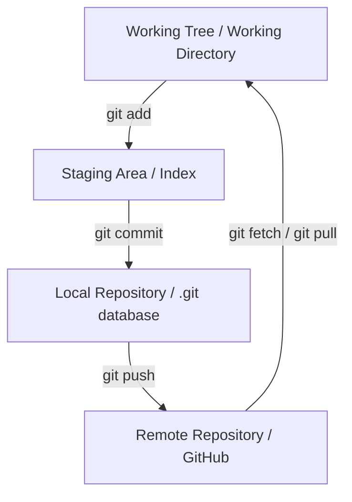
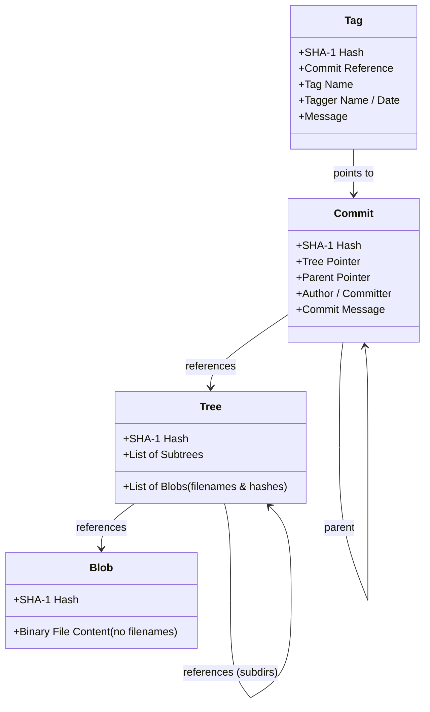
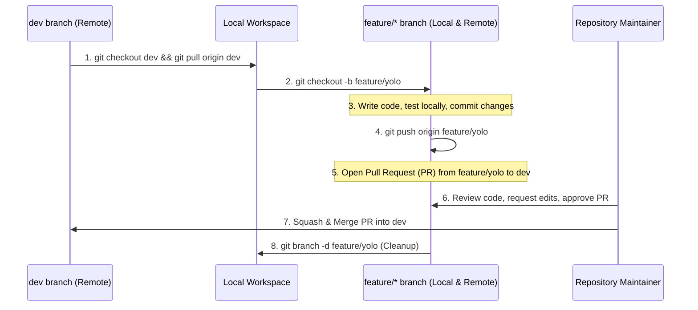
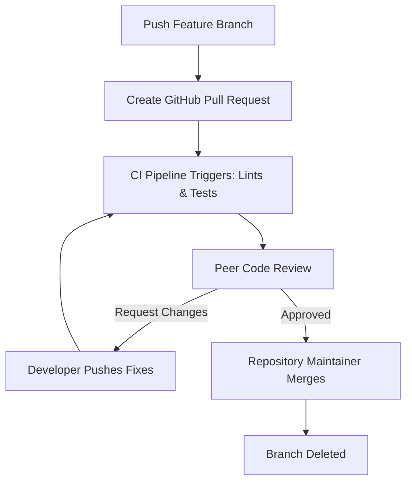
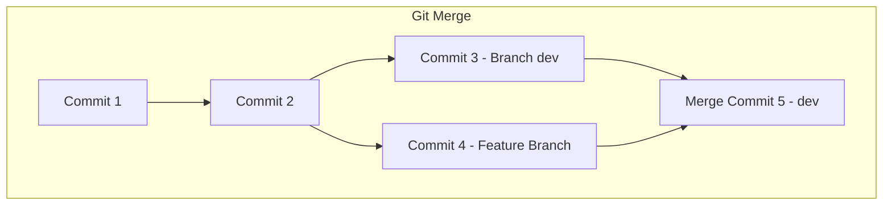
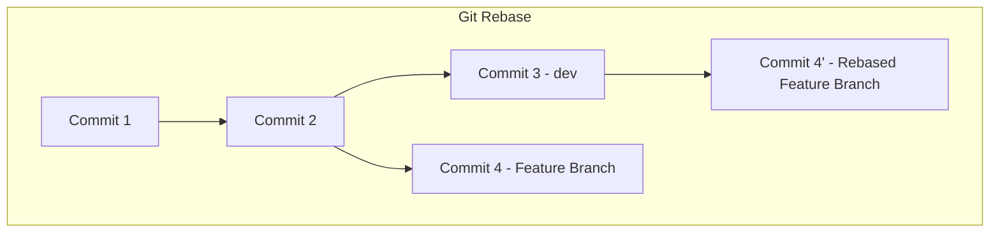
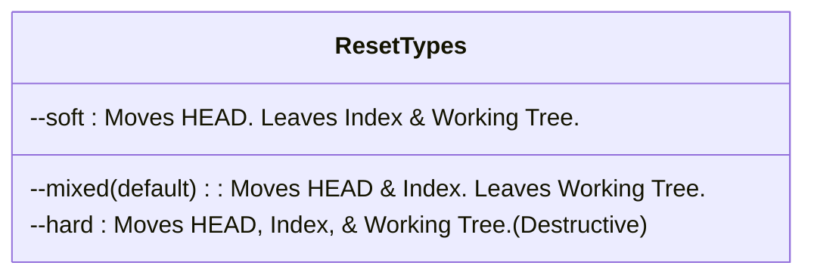

# Nepali Diet Advisory System: Git & GitHub Workflow Guide
## Enterprise-Grade Repository Management and Collaboration Standards

---

## Document Metadata

| Metadata Field | Value |
| :--- | :--- |
| **Project Name** | Nepali Diet Advisory System |
| **Target Audience** | Computer Engineering Development Team |
| **Document Classification** | Technical / Operational Standards |
| **Author** | Senior Devops / Git Maintainer |
| **Version** | 1.0.0 |
| **Date** | June 2026 |

---

## Table of Contents

1. [Chapter 1: Introduction & Project Context](#chapter-1-introduction--project-context)
2. [Chapter 2: Git Fundamentals & Internal Architecture](#chapter-2-git-fundamentals--internal-architecture)
3. [Chapter 3: Git Workflow & Branching Strategy](#chapter-3-git-workflow--branching-strategy)
4. [Chapter 4: Cloning, Fetching, Pulling, and Pushing](#chapter-4-cloning-fetching-pulling-and-pushing)
5. [Chapter 5: Commits & The Staging Area](#chapter-5-commits--the-staging-area)
6. [Chapter 6: Collaboration via Pull Requests](#chapter-6-collaboration-via-pull-requests)
7. [Chapter 7: Merging vs. Rebasing](#chapter-7-merging-vs-rebasing)
8. [Chapter 8: Merge Conflicts & Resolution](#chapter-8-merge-conflicts--resolution)
9. [Chapter 9: Advanced Git Mechanics](#chapter-9-advanced-git-mechanics)
10. [Chapter 10: Undoing Changes & History Repair](#chapter-10-undoing-changes--history-repair)
11. [Chapter 11: GitHub Platform Integration](#chapter-11-github-platform-integration)
12. [Chapter 12: Best Practices (50 Rules)](#chapter-12-best-practices-50-rules)
13. [Chapter 13: Common Mistakes & Troubleshooting (30 Scenarios)](#chapter-13-common-mistakes--troubleshooting-30-scenarios)
14. [Chapter 14: Comprehensive Git Command Reference](#chapter-14-comprehensive-git-command-reference)
15. [Chapter 15: Frequently Asked Questions (FAQ)](#chapter-15-frequently-asked-questions-faq)

---

## Chapter 1: Introduction & Project Context

In modern software engineering, especially within collaborative research and development environments, version control is the foundation of product reliability, code quality, and deployment velocity. 

For the **Nepali Diet Advisory System**, an AI-powered platform designed to provide personalized nutritional guidance, our technical stack relies on complex integrations including:
* **Object Detection / YOLO Pipeline** (`feature/yolo`) for analyzing food plates from image data.
* **Vector Databases / ChromaDB** (`feature/chromadb`) for storing embedding representations of Nepali recipes and dietary logs.
* **Large Language Models (LLMs)** (`feature/llm`) for generating localized and culturally contextualized dietary recommendations.
* **APIs / Backend** (`feature/backend`) built to serve model predictions and handle user accounts.
* **Web Client / Frontend** (`feature/frontend`) to interface with users.

Because our codebase spans Machine Learning (ML) pipelines, vector search stores, and web clients, maintaining a stable branch strategy is vital to prevent regression and runtime errors.

### The Branching Workflow Model

We follow a strict Git flow variant to manage concurrent feature development:

```
main  [Production-Ready / Stable Release Branch]
 │
 ▼
dev   [Integration & Integration Testing Branch]
 │
 ├── feature/yolo       [YOLO v8/v9 Food Classification Pipeline]
 ├── feature/frontend   [Vite / React Web Client Interface]
 ├── feature/backend    [FastAPI Service & Business Logic]
 ├── feature/chromadb   [ChromaDB Vector Retrieval & Embedding Database]
 └── feature/llm        [RAG Pipeline & LLM Prompting Interface]
```

### Mandatory Rules of the Repository

1. **Zero Direct Pushes to `main` or `dev`**: All direct writes to `main` and `dev` are strictly blocked using GitHub branch protection rules.
2. **Derivation Rule**: Every feature branch must originate from the latest state of the `dev` branch.
3. **Pull Request Isolation**: Developers must commit code exclusively to dedicated feature branches and submit a Pull Request (PR) into `dev`.
4. **Maintainer Merger Only**: Only the designated repository maintainer (acting as Release Engineer) is authorized to review, approve, and merge PRs.
5. **Release Promotion**: Once the code in `dev` is extensively tested and verified, a Pull Request is opened from `dev` to `main` to facilitate a production release.

---

### References

* [Official Git Documentation](https://git-scm.com/doc)
* [Atlassian Git Workflows Tutorial](https://www.atlassian.com/git/tutorials/comparing-workflows)
* [Pro Git Book - Chapter 3.4: Git Branching - Workflows](https://git-scm.com/book/en/v2/Git-Branching-Branching-Workflows)

---

## Chapter 2: Git Fundamentals & Internal Architecture

Unlike traditional Version Control Systems (VCS) like SVN or Perforce, which store files as a list of changes (delta-based versioning), Git treats its data as a stream of **snapshots** of a miniature filesystem. Every time you commit, Git records what your files look like at that exact moment and stores a reference to that snapshot.

### Git Architecture: The Four Areas

To work effectively with Git, you must understand its four architectural areas:



1. **Working Tree (Working Directory)**: The local sandbox containing the actual files you are currently modifying. These files exist physically on your disk.
2. **Staging Area (Index)**: A binary file (located at `.git/index`) that contains a list of files and their changes slated for the next commit. It serves as a preparation zone.
3. **Local Repository**: The `.git` directory inside your project folder. It contains all committed snapshots, branch pointers, configurations, and history.
4. **Remote Repository**: The central server (GitHub) hosting the codebase, enabling team collaboration.

### The Git Object Model

Internally, Git is a content-addressable storage system. It stores data using four primary object types, each identified by a SHA-1 hash (a 40-character hexadecimal string):



* **Blob (Binary Large Object)**: Stores file data without metadata (no file name, directory, or permissions). If two files in different directories contain the exact same content, they share the same blob.
* **Tree**: Represents a directory. It lists filenames, file permissions (modes), and points to blobs or other sub-trees.
* **Commit**: Stores metadata about a snapshot, including the author, committer, timestamp, commit message, a pointer to the root tree object, and pointers to one or more parent commits (enabling merge history).
* **Annotated Tag**: A permanent pointer to a specific commit, containing tagger metadata, a date, and a message.

### Inside the `.git` Directory

Run `ls -F .git` in your terminal to see the directory layout:
* `HEAD`: A file containing a reference to the branch you are currently on (e.g., `ref: refs/heads/dev`).
* `config`: Repository-specific configurations (remote URLs, branch tracking settings).
* `description`: Used by the GitWeb program (can be ignored).
* `hooks/`: Shell scripts that run before or after git actions (e.g., pre-commit linting).
* `info/exclude`: Global ignore file specific to this local clone (does not get pushed, unlike `.gitignore`).
* `index`: The Staging Area binary file.
* `objects/`: The database containing all blobs, trees, commits, and tags.
* `refs/`: References to heads (local branches), remotes (remote branches), and tags.

---

### References

* [Pro Git Book - Chapter 1.3: Getting Started - Git Basics](https://git-scm.com/book/en/v2/Getting-Started-Git-Basics)
* [Git Internals - Pro Git Book Chapter 10](https://git-scm.com/book/en/v2/Git-Internals-Git-Objects)
* [Atlassian Git Architecture Tutorial](https://www.atlassian.com/git/tutorials/saving-changes)

---

## Chapter 3: Git Workflow & Branching Strategy

Our development workflow guarantees code stability through strict branch classification and separation of concerns.

### Branch Strategy Classifications

1. **`main`**: The production branch. It must *always* represent compiling, tested, and deployable code. Direct commits are blocked.
2. **`dev`**: The integration branch. All developers merge their feature branches here. It is the active staging ground for testing before releasing to production. Direct commits are blocked.
3. **`feature/*`**: Short-lived branches dedicated to building specific features. They are branched from `dev` and merged back into `dev` via Pull Requests. Examples: `feature/yolo`, `feature/llm`.
4. **`hotfix/*`**: Branches created directly from `main` to address critical production issues. They bypass `dev` initially to push immediate patches, but must be merged back into both `main` and `dev` simultaneously.
5. **`release/*`**: Semi-stable branches created from `dev` when preparing for a structured release. Used to polish release notes, run automated QA regressions, and fix minor release-blocking bugs.

### Feature Branch Lifecycle



#### Step-by-Step Feature Development Guide

##### Step 3.1: Synchronize your Local Environment
Always pull the latest changes from the upstream `dev` branch before starting work:
```bash
git checkout dev
git pull origin dev
```
* `git checkout dev`: Switches your working tree to the local `dev` branch.
* `git pull origin dev`: Fetches updates from the remote repository and merges them into your active branch.

##### Step 3.2: Create a Dedicated Feature Branch
Use a descriptive branch name prefix:
```bash
git checkout -b feature/llm-rag-chain
```
* `-b`: Creates a new branch named `feature/llm-rag-chain` and immediately switches your working tree to it.

##### Step 3.3: Write Code and Commit
Stage and commit changes using logical units (see Chapter 5 for commit guidelines):
```bash
git add src/llm/rag_pipeline.py
git commit -m "feat(llm): implement RAG pipeline with ChromaDB integration"
```

##### Step 3.4: Keep Your Feature Branch Synced
If other features have been merged to `dev` since you branched, rebase your feature branch to avoid merge conflicts:
```bash
git fetch origin
git rebase origin/dev
```
* `git fetch origin`: Updates your remote tracking branches without changing local code.
* `git rebase origin/dev`: Re-applies your local commits on top of the latest changes in `dev`.

##### Step 3.5: Push and Open a Pull Request
Push your branch to GitHub to create a pull request:
```bash
git push -u origin feature/llm-rag-chain
```
* `-u` (or `--set-upstream`): Binds your local branch to the remote branch of the same name. Subsequent commands only require `git push` or `git pull`.

---

### References

* [GitHub Flow Documentation](https://docs.github.com/en/get-started/using-git/github-flow)
* [Atlassian Git Feature Branch Workflow](https://www.atlassian.com/git/tutorials/comparing-workflows/feature-branch-workflow)
* [Managing Branches - GitHub Docs](https://docs.github.com/en/pull-requests/collaborating-with-pull-requests/proposing-changes-to-your-work-with-pull-requests/about-branches)

---

## Chapter 4: Cloning, Fetching, Pulling, and Pushing

To collaborate effectively, you must understand how local files sync with the central server.

```mermaid
graph LR
    subgraph GitHub (Remote)
        R[Remote Repository]
    end
    subgraph Local Machine
        W[Working Tree]
        S[Staging Area]
        L[Local Repository]
    end

    R -->|git clone| L
    R -->|git fetch| L
    L -->|git checkout| W
    W -->|git add| S
    S -->|git commit| L
    L -->|git push| R
    R -->|git pull| W
```

### Git Clone

Cloning copies the entire project history, including branches, commits, and tags, to your local machine.

* **Standard Clone**:
  ```bash
  git clone https://github.com/HimalBhandari05/Nepali-Diet-Advisory-System.git
  ```
* **Recursive Clone (For Projects with Submodules)**:
  Useful if your project embeds external tools (e.g., custom YOLO engines):
  ```bash
  git clone --recursive https://github.com/HimalBhandari05/Nepali-Diet-Advisory-System.git
  ```
* **Shallow Clone (Optimized for Large AI Repositories)**:
  If a repository is bloated with historical model weights, you can clone only the latest commits:
  ```bash
  git clone --depth 1 https://github.com/HimalBhandari05/Nepali-Diet-Advisory-System.git
  ```

### Git Fetch vs. Git Pull

* **`git fetch`**: Downloads objects and refs from the remote repository to your local `.git` directory, but *does not modify your working tree*. It updates your tracking pointers (e.g., `origin/dev`), letting you safely inspect changes before merging.
  ```bash
  git fetch origin
  ```
* **`git pull`**: Fetches remote changes and immediately merges them into your current branch. It is a combined shortcut: `git fetch` followed by `git merge`.
  ```bash
  git pull origin dev
  ```
  > [!TIP]
  > To keep history clean and linear, pull using rebase instead of merge:
  > ```bash
  > git pull --rebase origin dev
  > ```

### Git Push

Pushing uploads local repository commits to the remote repository.

* **Standard Push**:
  ```bash
  git push origin feature/yolo
  ```
* **Safe Force Pushing (`--force-with-lease`)**:
  If you rewrite history on a feature branch (e.g., via interactive rebase) and need to update GitHub, *never* use `-f` or `--force`. It can overwrite work pushed by team members. Instead, use `--force-with-lease`, which checks if the remote branch has new commits before overwriting.
  ```bash
  git push --force-with-lease origin feature/yolo
  ```

---

### References

* [Pro Git Book - Chapter 2.5: Git Basics - Working with Remotes](https://git-scm.com/book/en/v2/Git-Basics-Working-with-Remotes)
* [Atlassian Syncing Data Tutorial](https://www.atlassian.com/git/tutorials/syncing)
* [GitHub Clone Documentation](https://docs.github.com/en/repositories/creating-and-managing-repositories/cloning-a-repository)

---

## Chapter 5: Commits & The Staging Area

A commit is a immutable snapshot of staged files. A clean commit history makes debugging, code reviews, and rollbacks much easier.

### Working with the Staging Area

* **View Workspace Status**:
  ```bash
  git status
  ```
  Shows untracked files, modified files, and files added to the Staging Area.
* **Stage Specific Files**:
  ```bash
  git add src/yolo/detect.py
  ```
* **Stage All Changes**:
  ```bash
  git add .
  ```
* **Interactive Patch Staging (`git add -p`)**:
  Allows you to review and select specific hunks of code to stage, keeping commits focused.
  ```bash
  git add -p src/yolo/detect.py
  ```
  *Git will display code changes and prompt you:*
  * `y`: Stage this hunk.
  * `n`: Do not stage this hunk.
  * `s`: Split the hunk into smaller changes.
  * `e`: Manually edit the staging selection.

### Anatomy of a Commit Message

We enforce the **Conventional Commits** specification. Commit messages must be structured as follows:

```text
<type>(<scope>): <description>

[optional body]

[optional footer(s)]
```

#### Commit Types
* `feat`: A new feature (e.g., `feat(llm): integrate Llama-3 API`).
* `fix`: A bug fix (e.g., `fix(yolo): resolve bounding box overlap offset`).
* `docs`: Documentation updates only (e.g., `docs(readme): update setup guide`).
* `style`: Styling changes that do not affect code logic (whitespace, formatting).
* `refactor`: Code changes that neither fix bugs nor add features.
* `perf`: Performance improvements.
* `test`: Adding or correcting tests.
* `chore`: Build steps, dependency updates, or tool configurations.

#### Example of an Ideal Commit Message

```text
feat(chromadb): implement semantic recipe search

- Created vector_store.py client configuration
- Configured L2 distance metric for cosine similarity searches
- Added unit tests for query retrieval latency

Resolves: #142
```

---

### References

* [Conventional Commits Specification](https://www.conventionalcommits.org/)
* [Pro Git Book - Chapter 2.2: Git Basics - Recording Changes to the Repository](https://git-scm.com/book/en/v2/Git-Basics-Recording-Changes-to-the-Repository)
* [Atlassian Saving Changes Tutorial](https://www.atlassian.com/git/tutorials/saving-changes)

---

## Chapter 6: Collaboration via Pull Requests

Pull Requests (PRs) are the mechanism we use to propose, discuss, review, and approve changes before merging them into `dev` or `main`.



### Pull Request Lifecycle

#### Step 6.1: Open a Draft Pull Request
When you begin working on a complex feature, push your branch and open a **Draft Pull Request** on GitHub. This flags to the team that work is in progress, preventing overlapping efforts.
* [Creating a Pull Request on GitHub](https://docs.github.com/en/pull-requests/collaborating-with-pull-requests/proposing-changes-to-your-work-with-pull-requests/creating-a-pull-request)

#### Step 6.2: Transition to Ready for Review
Once local tests pass, change your PR status from "Draft" to "Ready for Review" to alert the team.

#### Step 6.3: Code Review Standards
* Every PR requires approval from at least one core team member.
* **Reviewers**: Focus on architectural patterns, edge cases, error handling, performance issues (e.g., loading model weights to memory multiple times), and compliance with the styling guides.
* Use GitHub's line comments to discuss specific code blocks:
  * [Reviewing Changes in Pull Requests](https://docs.github.com/en/pull-requests/collaborating-with-pull-requests/reviewing-changes-in-pull-requests/about-pull-request-reviews)

#### Step 6.4: Integrate and Address Feedback
Make requested updates locally on your feature branch, commit them, and push them. The PR updates automatically.

#### Step 6.5: Merging the Pull Request
Once approved, the repository maintainer will merge the PR.
* We use **Squash and Merge** for merging feature branches into `dev`. This squashes all commits from the feature branch into a single, clean commit on `dev`, keeping history readable.
* When merging `dev` into `main`, we use a standard **Merge Commit** to preserve version milestones.

---

### References

* [GitHub Pull Request Documentation](https://docs.github.com/en/pull-requests)
* [Atlassian Pull Requests Tutorial](https://www.atlassian.com/git/tutorials/making-a-pull-request)
* [GitHub Collaboration Guides](https://docs.github.com/en/get-started/quickstart/collaborating-with-git)

---

## Chapter 7: Merging vs. Rebasing

Integrating branches is a key part of Git collaboration. You can do this using either `merge` or `rebase`.

### Git Merge

A merge combines two branches by performing a three-way merge (common ancestor, current tip, target tip) and creating a new **merge commit**.



#### Properties of Merge
* **Non-destructive**: Does not rewrite history; original commits remain untouched.
* **Traceable**: Preserves the exact sequence of historical commits.
* **Cluttered**: Can lead to "merge spaghetti" in active repositories.

```bash
git checkout dev
git merge feature/yolo
```

### Git Rebase

Rebasing moves or combines a sequence of commits to a new base commit, creating a linear history.



#### Properties of Rebase
* **Clean History**: Eliminates unnecessary merge commits, creating a linear project timeline.
* **Destructive**: Rewrites history by creating new commits with different SHA-1 hashes.
* **Golden Rule**: **Never rebase public commits** on shared branches (like `dev` or `main`). Only rebase your local feature branches before merging them.

```bash
git checkout feature/yolo
git rebase dev
```

### Interactive Rebase

Interactive rebasing (`git rebase -i`) lets you rewrite, combine, delete, or rename commits before pushing. It is perfect for cleaning up a local history (e.g., squashing "wip" or "typo" commits) before submitting a PR.

```bash
git rebase -i HEAD~4
```
*(Rebases the last 4 commits on your current branch)*

An editor opens showing your commits:
```text
pick a8b21f9 feat(yolo): import model configuration
pick 4c20da1 wip: adding tests
pick c7b8e1a fix: fix model load error
pick 22ff009 docs: document yolo usage

# Rebase Commands:
# p, pick = use commit
# r, reword = use commit, but edit the commit message
# e, edit = use commit, but stop for amending
# s, squash = meld into previous commit, combine messages
# d, drop = remove commit
```

To squash the "wip" and "fix" commits into the first feature commit:
```text
pick a8b21f9 feat(yolo): import model configuration
squash 4c20da1 wip: adding tests
squash c7b8e1a fix: fix model load error
pick 22ff009 docs: document yolo usage
```
Save and close the editor. Git will prompt you to write a consolidated commit message.

---

### References

* [Pro Git Book - Chapter 3.6: Git Branching - Rebasing](https://git-scm.com/book/en/v2/Git-Branching-Rebasing)
* [Atlassian Merging vs Rebasing Tutorial](https://www.atlassian.com/git/tutorials/merging-vs-rebasing)
* [GitHub Rebasing Documentation](https://docs.github.com/en/get-started/using-git/about-git-rebase)

---

## Chapter 8: Merge Conflicts & Resolution

A merge conflict happens when Git cannot automatically resolve differences in code between two commits. This typically occurs when two developers modify the same lines of a file, or one developer deletes a file that another is modifying.

```text
<<<<<<< HEAD
    model = YOLO("yolov8n.pt")  # Use nano model for performance
=======
    model = YOLO("yolov9c.pt")  # Use custom YOLOv9 checkpoint
>>>>>>> feature/yolo-v9
```

### Anatomy of a Conflict Marker

* `<<<<<<< HEAD`: Marks the start of the conflict. The code below is from your current target branch.
* `=======`: The divider line separating conflicting versions.
* `>>>>>>> feature/yolo-v9`: Marks the end of the conflict. The code above is from the branch you are merging.

### Step-by-Step Resolution Process

#### Step 8.1: Identify Conflicting Files
Run `git status` to see which files are blocked:
```bash
git status
# Unmerged paths:
#   both modified:   src/yolo/detect.py
```

#### Step 8.2: Open the File and Decide
Open `src/yolo/detect.py` in your code editor. Decide which changes to keep, combining them if necessary. Clean up the conflict markers (`<<<<<<<`, `=======`, `>>>>>>>`).

For example, to keep YOLOv9 but add the performance comment:
```python
    model = YOLO("yolov9c.pt")  # Use custom YOLOv9 checkpoint for performance
```

#### Step 8.3: Configure the diff3 Conflict Style (Highly Recommended)
Change your Git config to show the common ancestor's code as well. This provides the context you need to resolve complex conflicts:
```bash
git config --global merge.conflictstyle diff3
```

#### Step 8.4: Add and Complete the Operation
Once conflicts are resolved:
1. Stage the resolved files:
   ```bash
   git add src/yolo/detect.py
   ```
2. Commit the changes:
   * **If resolving during a merge**:
     ```bash
     git commit -m "merge: resolve merge conflicts between dev and feature/yolo-v9"
     ```
   * **If resolving during a rebase**:
     ```bash
     git rebase --continue
     ```

---

### References

* [Resolving Merge Conflicts - GitHub Docs](https://docs.github.com/en/pull-requests/collaborating-with-pull-requests/addressing-merge-conflicts/resolving-a-merge-conflict-using-the-command-line)
* [Pro Git Book - Chapter 3.2: Basic Branching and Merging](https://git-scm.com/book/en/v2/Git-Branching-Basic-Branching-and-Merging#_basic_merge_conflicts)
* [Atlassian How to Resolve Merge Conflicts](https://www.atlassian.com/git/tutorials/using-branches/merge-conflicts)

---

## Chapter 9: Advanced Git Mechanics

This section covers features used to manage complex history tasks, save temporary work, and handle production deployments.

### Git Cherry-Pick

`git cherry-pick` lets you copy a commit from one branch and apply it to another by its commit hash. This is useful for moving a hotfix from a feature branch directly into `dev` without merging the entire feature.

```bash
git checkout dev
git cherry-pick e3d8a12
```
*Copies the snapshot of commit `e3d8a12` and applies it as a new commit on `dev`.*

### Git Stash

`git stash` temporarily shelves local modifications so you can switch branches without committing unfinished work. It saves your changes and restores your working directory to match the `HEAD` commit.

* **Stash Unfinished Changes**:
  ```bash
  git stash save "wip: debugging prompt template response parser"
  ```
* **Stash Including Untracked Files**:
  ```bash
  git stash -u
  ```
* **List Saved Stashes**:
  ```bash
  git stash list
  # stash@{0}: On feature/llm: wip: debugging prompt template...
  ```
* **Apply a Stash and Remove it from the List**:
  ```bash
  git stash pop stash@{0}
  ```
* **Apply a Stash but Keep it in the List**:
  ```bash
  git stash apply stash@{0}
  ```
* **Delete a Stash**:
  ```bash
  git stash drop stash@{0}
  ```

### Git Tags & GitHub Releases

Tags serve as reference points for releases. We use **Annotated Tags** for production milestones because they store the creator's name, email, date, and a message.

* **Create an Annotated Tag**:
  ```bash
  git tag -a v1.0.0 -m "Release version 1.0.0 - Initial deployment of Nepali Diet Advisory System"
  ```
* **Push Tags to GitHub**:
  ```bash
  git push origin v1.0.0
  ```
* **GitHub Releases**:
  Once the tag is pushed, draft a release on GitHub. This generates a release page listing the changes, assets, and source code.
  * [About GitHub Releases](https://docs.github.com/en/repositories/releasing-projects-on-github/about-releases)

---

### References

* [Pro Git Book - Chapter 7.3: Git Tools - Stashing and Cleaning](https://git-scm.com/book/en/v2/Git-Tools-Stashing-and-Cleaning)
* [Atlassian Git Cherry-Pick Tutorial](https://www.atlassian.com/git/tutorials/cherry-pick)
* [GitHub Releases Guide](https://docs.github.com/en/repositories/releasing-projects-on-github)

---

## Chapter 10: Undoing Changes & History Repair

This chapter covers how to safely fix mistakes, restore files, and recover lost commits.

### Undoing Working Directory Changes

* **`git restore`**:
  Discard local changes made to a file, reverting it to the index or `HEAD` state.
  ```bash
  git restore src/backend/main.py
  ```
* **`git restore --staged`**:
  Unstage a file, keeping its local changes.
  ```bash
  git restore --staged src/backend/main.py
  ```

### Git Reset: Soft, Mixed, and Hard

`git reset` moves the current branch pointer to a specific commit. The main differences are how it updates the index and working directory.



* **`git reset --soft <commit>`**:
  Moves your branch pointer back to `<commit>`, but leaves your index (staged changes) and working tree untouched. This is useful for squashing commits manually.
  ```bash
  git reset --soft HEAD~1
  ```
* **`git reset --mixed <commit>`**:
  Moves your branch pointer and updates the index, but leaves the working tree alone. Changes are preserved as unstaged edits.
  ```bash
  git reset HEAD~1
  ```
* **`git reset --hard <commit>`**:
  Moves your branch pointer, resets the index, and overwrites your working tree. **Caution**: Any uncommitted changes are lost forever.
  ```bash
  git reset --hard HEAD~1
  ```

### Git Revert

`git revert` undoes the changes of an existing commit by creating a new commit with the opposite changes. This is the safest way to undo pushed history because it does not rewrite history.

```bash
git revert d548a2f
```

### Git Reflog: Recovering Lost Commits

`git reflog` records every commit, checkout, reset, and merge you perform locally. If you accidently delete a branch or perform a bad `git reset --hard`, you can find the lost commit hash here.

```bash
git reflog
# 78a221d HEAD@{0}: reset: moving to HEAD~1
# a8201fa HEAD@{1}: commit: feat(yolo): setup pipeline model
```
To restore your branch to the state before the bad reset:
```bash
git reset --hard a8201fa
```

---

### References

* [Pro Git Book - Chapter 7.7: Git Tools - Reset Demystified](https://git-scm.com/book/en/v2/Git-Tools-Reset-Demystified)
* [Atlassian Git Reset Tutorial](https://www.atlassian.com/git/tutorials/undoing-changes/git-reset)
* [Atlassian Git Revert Tutorial](https://www.atlassian.com/git/tutorials/undoing-changes/git-revert)

---

## Chapter 11: GitHub Platform Integration

We use GitHub's platform tools to manage projects, protect branches, and automate CI/CD pipelines.

### GitHub Branch Protection

To prevent direct updates to our stable branches, we configure branch protection rules on `main` and `dev`.

* **Settings Required**:
  1. **Require a Pull Request before merging**: Blocks direct pushes.
  2. **Require Approvals**: At least one review is required before merging.
  3. **Require Status Checks to Pass**: Automated tests and lints must pass before a PR can be merged.
* [GitHub Branch Protection Rules Documentation](https://docs.github.com/en/repositories/configuring-branches-and-merges-in-your-repository/defining-the-mergeability-of-pull-requests/about-protected-branches)

### GitHub Issues & Projects

* **GitHub Issues**:
  Used to report bugs, request features, and plan tasks. Use the templates provided to structure bug reports or feature requests.
  * [GitHub Issues Documentation](https://docs.github.com/en/issues)
* **GitHub Projects**:
  A Kanban board that tracks team tasks. Ensure that every Issue is linked to our project board, placed in the appropriate column (`Todo`, `In Progress`, `Review`, `Done`), and assigned to a team member.
  * [GitHub Projects Documentation](https://docs.github.com/en/issues/planning-and-tracking-with-projects/learning-about-projects/about-projects)

### GitHub Actions (Overview)

We run continuous integration pipelines in GitHub Actions whenever a PR is created or updated.

Our automation workflow includes:
1. **Linter Validation**: Runs `flake8` or `black` on backend code, and `eslint` on frontend code.
2. **Unit Tests**: Runs `pytest` to verify the backend and ML pipelines, and `vitest` for the frontend.
3. **Containerization**: Validates that Dockerfiles for our backend and AI services build correctly.

* [GitHub Actions Documentation](https://docs.github.com/en/actions)

---

### References

* [GitHub Flow and Platforms Overview](https://docs.github.com/en/get-started)
* [Atlassian Continuous Integration Tutorial](https://www.atlassian.com/continuous-delivery/continuous-integration)

---

## Chapter 12: Best Practices (50 Rules)

Maintain these 50 strict rules to ensure repository health and development velocity:

### Commits and Local History
1. **Commit Early & Often**: Make frequent commits for small, logical units of work.
2. **Never Commit Large Binary Files**: Do not commit model weights (`.pt`, `.onnx`) or vector store database files (`.db`) directly. Use git-lfs or external object storage (e.g., S3).
3. **Follow Conventional Commits**: Ensure all commit messages start with type tags (e.g., `feat(yolo):`, `fix(llm):`).
4. **Use Imperative Present Tense**: Write "Add detector node" instead of "Added detector node".
5. **Keep the Subject Line Under 50 Characters**: Summarize changes concisely.
6. **Include a Detailed Body**: Explain *why* you made a change, not just *what* changed, if it is not immediately obvious.
7. **Separate Subject from Body**: Insert a blank line between the subject and the body of your commit messages.
8. **Do Not Commit Secrets**: Never commit passwords, API keys (e.g., OpenAI/Llama API keys), or database credentials. Use `.env` files and add them to `.gitignore`.
9. **Stage Interactively**: Use `git add -p` to verify and stage specific changes.
10. **Clean History Before Pushing**: Use interactive rebasing (`git rebase -i`) to squash temporary or work-in-progress commits before pushing a feature branch.
11. **Do Not Rewrite Shared History**: Never perform a rebase or push force operations on `dev` or `main`.
12. **Double-Check Diff Before Committing**: Run `git diff --staged` to verify exactly what changes you are about to save.

### Branch Management
13. **Keep Branches Short-Lived**: Merge feature branches within a few days to avoid diverging from `dev`.
14. **Use Prefix Naming Conventions**: Name branches starting with `feature/`, `bugfix/`, `hotfix/`, or `release/`.
15. **Delete Branches After Merging**: Remove remote and local feature branches once they are successfully merged.
16. **Synchronize Main Branches Regularly**: Update your local `dev` branch daily before starting work.
17. **Always Branch from the Correct Base**: Ensure all feature branches are created from the latest version of `dev`.
18. **Never Checkout Commits Directly**: Avoid "detached HEAD" states. Work on named branches.
19. **Run Local Tests Before Branching**: Make sure tests pass before creating a new branch.
20. **Use Tracking Branches**: Always push using `git push -u` to establish a tracking connection for remote branches.
21. **Keep Branch Purposes Single-Focused**: Do not combine backend enhancements and frontend UI modifications in the same feature branch.

### Pull Requests & Reviews
22. **Submit Draft PRs Early**: Create a draft PR as soon as you start working on a feature to share progress.
23. **Write Descriptive PR Overviews**: Outline the purpose, implementation details, testing strategy, and linked issues in the PR description.
24. **Provide Screenshots for UI Changes**: Add before-and-after screenshots or videos to frontend PRs.
25. **Link Issues to PRs**: Use keywords like `Closes #12` to automatically close issues when a PR is merged.
26. **Ensure Clean CI Status**: Fix all lint and test failures before requesting reviews.
27. **Do Not Self-Approve**: Wait for at least one core team member to review and approve your PR.
28. **Review Thoroughly**: Check PRs for efficiency, error handling, and logical errors. Do not just look at code style.
29. **Respond Constructively**: Address review feedback with polite explanations and updates.
30. **Rebase feature branches before merging**: Pull the latest changes from `dev` and rebase your feature branch before requesting a final review.
31. **Keep PRs Small**: Keep changes under 400 lines of code. Smaller PRs are reviewed faster and more thoroughly.
32. **Use Squash and Merge**: Squash feature branch commits when merging to `dev` to keep the master history clean.

### Workspace Hygiene & Git Configuration
33. **Keep `.gitignore` Updated**: Ensure local build files, Virtual Environments (`.venv`), cache files, and logs are globally ignored.
34. **Configure Global Username & Email**: Use your actual name and academic/professional email for all commits.
35. **Configure line endings correctly**: Use `git config --global autocrlf input` on macOS/Linux, and `true` on Windows to avoid line ending mismatches.
36. **Use SSH Keys**: Secure repository access by using SSH keys instead of HTTPS with personal access tokens.
37. **Prune Stale Branches**: Clean up local tracking references for deleted remote branches regularly:
    ```bash
    git fetch --prune
    ```
38. **Create Aliases for Common Commands**: Save time by setting up shortcuts in your `.gitconfig` (e.g., `git co` for `checkout`).
39. **Avoid Using `git add .` blindly**: Review your changes first using `git status` to avoid staging temp files.
40. **Use `git stash` with description labels**: Always provide a name for stashes so you can easily identify them later.

### Release & Production Maintenance
41. **Semantic Versioning**: Tag production releases using semantic versioning (e.g., `v1.0.0`, `v1.1.0`).
42. **Use Annotated Tags for Releases**: Always use the `-a` flag when tagging releases to record metadata.
43. **Document Releases**: Add clear release notes summarizing features, bug fixes, and contributors.
44. **Verify Hotfixes Against `dev`**: Make sure hotfixes are merged into both `main` and `dev` to prevent regressions.
45. **Lock Down Production Releases**: Set up protection rules to ensure only repo maintainers can tag or release.

### AI/ML Project Specifics
46. **Use `.gitkeep` for empty directories**: Keep required project folders (like `data/raw` or `models/checkpoints`) in the repository without checking in data.
47. **Never Check In Datasets**: Add large CSV, JSON, or images datasets to `.gitignore`.
48. **Verify Model Configurations**: Check in configuration files (e.g., YOLO `.yaml` parameters) while ignoring actual binary weights.
49. **Log Seed Settings**: Ensure code reproducible configurations (e.g., PyTorch random seed variables) are committed.
50. **Validate Dependencies**: Check in lockfiles (`pyproject.toml`, `uv.lock`) to ensure consistent builds across environments.

---

### References
* [Pro Git Book - Appendix C: Git Commands](https://git-scm.com/book/en/v2/Appendix-C:-Git-Commands-Basic-Snapshotting)
* [Atlassian Best Practices Guide](https://www.atlassian.com/git/tutorials/best-practices)

---

## Chapter 13: Common Mistakes & Troubleshooting (30 Scenarios)

Here are 30 common Git mistakes, why they happen, and step-by-step instructions to fix them.

#### Scenario 1: Committed Secrets / API Keys
* **Why it happened**: You staged and committed a configuration file containing raw API keys or passwords.
* **How to fix it**:
  1. Remove the secrets from the file and store them in a `.env` file.
  2. Use `git filter-repo` or BFG Repo-Cleaner to purge the file and its history from the repository.
  3. **Crucial**: Immediately rotate the leaked API keys.

#### Scenario 2: Committed to `dev` or `main` Directly
* **Why it happened**: You forgot to checkout a feature branch before committing.
* **How to fix it**:
  If you haven't pushed yet:
  ```bash
  # 1. Create a new branch with your current changes
  git branch feature/yolo-fix
  # 2. Reset your local branch back to the remote state
  git reset --hard origin/dev
  # 3. Switch to your new branch
  git checkout feature/yolo-fix
  ```

#### Scenario 3: Tyrannical Merge Conflicts During Rebase
* **Why it happened**: You did not update your feature branch for a long time, leading to conflicts on almost every commit during rebase.
* **How to fix it**:
  If the rebase gets too messy and you want to start over:
  ```bash
  git rebase --abort
  ```
  *Optionally, merge `dev` into your feature branch instead of rebasing to resolve conflicts in a single commit.*

#### Scenario 4: Detached HEAD State
* **Why it happened**: You checked out a specific commit hash (e.g., `git checkout a8d3f1a`) instead of a branch.
* **How to fix it**:
  To discard modifications, switch back to your branch:
  ```bash
  git checkout dev
  ```
  To keep changes made in a detached HEAD:
  ```bash
  git checkout -b feature/temporary-recovery
  ```

#### Scenario 5: Accidental `git reset --hard` (Loss of Local Work)
* **Why it happened**: You ran `git reset --hard` on the wrong branch, discarding uncommitted work.
* **How to fix it**:
  Find the commit hash before the reset using `reflog`:
  ```bash
  git reflog
  # Look for the last commit before the reset (e.g., e3a12f9)
  git reset --hard e3a12f9
  ```
  *(Note: Unsaved changes that were never added to the index cannot be recovered).*

#### Scenario 6: Typo in the Most Recent Commit Message
* **Why it happened**: You noticed a spelling mistake in your commit message immediately after committing.
* **How to fix it**:
  Modify the last commit message:
  ```bash
  git commit --amend -m "feat(yolo): fix bounding box coordinate offset calculation"
  ```
  *(Only do this if the commit hasn't been pushed yet).*

#### Scenario 7: Forgot to Add a File to the Last Commit
* **Why it happened**: You committed your changes but forgot to include one of the modified files.
* **How to fix it**:
  Stage the missing file and combine it with the previous commit:
  ```bash
  git add src/yolo/utils.py
  git commit --amend --no-edit
  ```

#### Scenario 8: Pushed the Wrong Branch to GitHub
* **Why it happened**: You specified the wrong local/remote branch pairing in your push command.
* **How to fix it**:
  Delete the incorrect branch from the remote:
  ```bash
  git push origin --delete incorrect-branch-name
  ```

#### Scenario 9: Merge Conflict with a Deleted File
* **Why it happened**: One developer modified a file, while another deleted it.
* **How to fix it**:
  Decide if the file is still needed:
  * To delete the file: `git rm src/yolo/detect.py`
  * To keep the file: `git add src/yolo/detect.py`
  Complete the merge or rebase.

#### Scenario 10: Remote Push Rejected Due to Diverged History
* **Why it happened**: You rebased your branch locally, changing the commit hashes. GitHub rejected the push because your local history diverged from the remote.
* **How to fix it**:
  Force push safely:
  ```bash
  git push --force-with-lease origin feature/yolo
  ```

#### Scenario 11: Stashed Changes Disappeared
* **Why it happened**: You ran `git stash pop` but cannot find the changes, or you accidently dropped the stash.
* **How to fix it**:
  Find the lost stash commit hash using the reflog:
  ```bash
  git fsck --no-reflogs | grep commit
  # Check the commits using git show <hash> to find your stashed changes
  git stash apply <hash>
  ```

#### Scenario 12: Cloning takes forever (Repository Bloat)
* **Why it happened**: The repository contains large datasets or model weights in its history.
* **How to fix it**:
  Perform a shallow clone to download only the latest commits:
  ```bash
  git clone --depth 1 https://github.com/HimalBhandari05/Nepali-Diet-Advisory-System.git
  ```

#### Scenario 13: Staged the Wrong File
* **Why it happened**: You ran `git add .` and staged a temp file you didn't mean to commit.
* **How to fix it**:
  Unstage the file while keeping your local changes:
  ```bash
  git restore --staged temp_output.json
  ```

#### Scenario 14: Restored/Discarded the Wrong File
* **Why it happened**: You ran `git restore` on the wrong file, discarding your unsaved changes.
* **How to fix it**:
  Unfortunately, if the changes were never staged or committed, Git cannot recover them. **Tip**: Always review status and diffs before running restore commands.

#### Scenario 15: Merge Conflict in binary models (`.pt`)
* **Why it happened**: Two developers committed different versions of a model file.
* **How to fix it**:
  Git cannot merge binary changes line-by-line. You must choose one file version over the other:
  * Keep your version: `git checkout --ours src/yolo/best.pt`
  * Keep their version: `git checkout --theirs src/yolo/best.pt`
  Add and commit:
  ```bash
  git add src/yolo/best.pt
  git commit -m "merge: resolve binary conflict by keeping latest model weight"
  ```

#### Scenario 16: Accidentally Deleted a Local Branch
* **Why it happened**: You ran `git branch -D` on a branch you thought was merged but still contained unmerged work.
* **How to fix it**:
  Find the branch's last commit hash in your reflog:
  ```bash
  git reflog
  # Locate the last commit on the deleted branch (e.g., b9c12e8)
  git checkout -b feature/yolo-recovered b9c12e8
  ```

#### Scenario 17: Local Tracking Branches are out of sync with GitHub
* **Why it happened**: Remote branches were deleted, but they still appear as options on your local machine.
* **How to fix it**:
  Prune local tracking pointers:
  ```bash
  git fetch --prune
  ```

#### Scenario 18: File is matching `.gitignore` but still tracked
* **Why it happened**: The file was already tracked in the repository before it was added to `.gitignore`.
* **How to fix it**:
  Remove the file from the repository index while keeping it locally:
  ```bash
  git rm --cached path/to/large_dataset.csv
  # Commit this removal
  git commit -m "chore: stop tracking large dataset file"
  ```

#### Scenario 19: Merge PR contains lots of unrelated commits
* **Why it happened**: You did not pull/rebase from `dev` recently, so your PR contains outdated commits from upstream.
* **How to fix it**:
  Abort or merge the latest `dev` branch into your feature branch, resolving conflicts locally before pushing.

#### Scenario 20: Pulling from remote overrides local edits
* **Why it happened**: You pulled remote changes that conflicts with your local edits.
* **How to fix it**:
  Stash your changes first, pull the remote updates, and then apply your stash:
  ```bash
  git stash
  git pull origin dev
  git stash pop
  ```

#### Scenario 21: Forked repository is out of sync
* **Why it happened**: You cloned a fork but did not configure upstream tracking pointers.
* **How to fix it**:
  1. Add the upstream remote:
     ```bash
     git remote add upstream https://github.com/HimalBhandari05/Nepali-Diet-Advisory-System.git
     ```
  2. Fetch and merge upstream changes:
     ```bash
     git fetch upstream
     git checkout dev
     git merge upstream/dev
     ```

#### Scenario 22: Pushed commits to the wrong remote
* **Why it happened**: You configured multiple remotes and pushed without specifying the correct target destination.
* **How to fix it**:
  Delete the incorrect remote push and push to the correct remote target:
  ```bash
  git push origin --delete feature/yolo
  git push upstream feature/yolo
  ```

#### Scenario 23: Rebase fails mid-way
* **Why it happened**: A merge conflict occurred during one of the rebase steps.
* **How to fix it**:
  Open the conflicting files, resolve the issues, and run:
  ```bash
  git add resolved_file.py
  git rebase --continue
  ```
  To cancel the rebase and revert to your original state, run `git rebase --abort`.

#### Scenario 24: Git says a file is modified but `git diff` shows nothing
* **Why it happened**: File permissions (executability flags) changed, or line ending characters differ (LF vs CRLF).
* **How to fix it**:
  Configure Git to ignore file permission changes:
  ```bash
  git config core.fileMode false
  ```

#### Scenario 25: Cherry-picked the wrong commit
* **Why it happened**: You copied the wrong commit hash during cherry-pick.
* **How to fix it**:
  Abort the cherry-pick if in progress:
  ```bash
  git cherry-pick --abort
  ```
  If already committed, revert the cherry-picked commit:
  ```bash
  git revert HEAD
  ```

#### Scenario 26: Commits show the wrong author profile link on GitHub
* **Why it happened**: Your local `user.email` configuration does not match the email registered on your GitHub account.
* **How to fix it**:
  Update your Git configuration:
  ```bash
  git config --global user.email "your_email@domain.com"
  ```
  *(Note: This only affects future commits. Historical commits must be rewritten using tools like `git-filter-repo` if correction is required).*

#### Scenario 27: Accidental merge commit created on a local feature branch
* **Why it happened**: You ran `git pull` without the `--rebase` flag, creating an unnecessary merge commit.
* **How to fix it**:
  Reset your branch pointer to the commit before the merge:
  ```bash
  git reset --hard HEAD~1
  # Pull using rebase instead
  git pull --rebase origin dev
  ```

#### Scenario 28: Git status shows modifications in submodules
* **Why it happened**: The submodule commit pointer changed on the remote, or you modified files inside the submodule directory.
* **How to fix it**:
  Reset the submodule to its configured commit:
  ```bash
  git submodule update --init --recursive --force
  ```

#### Scenario 29: Stash list is cluttered and difficult to read
* **Why it happened**: You did not clean up stashed changes after applying them.
* **How to fix it**:
  Clear all saved stashes:
  ```bash
  git stash clear
  ```

#### Scenario 30: Switched branches and lost unstaged files
* **Why it happened**: You switched branches and Git overwrote your unstaged modifications.
* **How to fix it**:
  Usually, Git blocks checkouts that would overwrite local modifications. However, if force checkout (`-f`) was used, those unsaved modifications are permanently lost.

---

### References
* [Pro Git Book - Chapter 7.1: Git Tools - Revision Selection](https://git-scm.com/book/en/v2/Git-Tools-Revision-Selection)
* [Atlassian Resolving Git Problems Guide](https://www.atlassian.com/git/tutorials/undoing-changes)

---

## Chapter 14: Comprehensive Git Command Reference

| Command Category | Command Syntax | Functional Description | Production Example | Operational Notes |
| :--- | :--- | :--- | :--- | :--- |
| **Setup** | `git init` | Initializes a new local Git repository. | `git init` | Creates a hidden `.git` folder in your current directory. |
| **Setup** | `git clone [url]` | Copies a remote repository to your local machine. | `git clone https://github.com/example/repo.git` | Downloads all history, commits, and branches. |
| **Setup** | `git config --global [key] [val]` | Sets configuration options globally. | `git config --global user.name "John Doe"` | Configures global commit author details. |
| **Inspection** | `git status` | Displays untracked, modified, and staged files. | `git status` | Shows workspace status. |
| **Inspection** | `git diff` | Shows differences between working files and commits. | `git diff src/yolo/detect.py` | Compares unstaged changes with the index. |
| **Inspection** | `git log --oneline` | Shows a compact, single-line commit history. | `git log --oneline --graph` | Displays the history tree as a graph. |
| **Staging** | `git add [file]` | Stages modifications for the next commit. | `git add src/llm/chains.py` | Prepares changes for a commit. |
| **Staging** | `git add -p [file]` | Stages changes interactively by selecting hunks. | `git add -p src/llm/chains.py` | Allows selective staging. |
| **Commits** | `git commit -m "[msg]"` | Saves staged changes as a new snapshot. | `git commit -m "feat: add pipeline"` | Creates a new commit with a message. |
| **Commits** | `git commit --amend` | Combines current changes with the last commit. | `git commit --amend --no-edit` | Modifies the last commit without changing its message. |
| **Branches** | `git branch` | Lists local branches. | `git branch` | The active branch is highlighted in green. |
| **Branches** | `git checkout [branch]` | Switches your working tree to another branch. | `git checkout dev` | Updates files to match the selected branch. |
| **Branches** | `git checkout -b [new]` | Creates a new branch and switches to it. | `git checkout -b feature/yolo` | Shortcut for combining branch creation and checkout. |
| **Branches** | `git branch -d [branch]` | Deletes a branch locally. | `git branch -d feature/yolo` | Safe delete: blocks deletion if there are unmerged commits. |
| **Branches** | `git branch -D [branch]` | Force deletes a branch locally. | `git branch -D feature/yolo` | **Caution**: Discards unmerged changes. |
| **Syncing** | `git fetch [remote]` | Downloads remote history without modifying files. | `git fetch origin` | Updates tracking branch references. |
| **Syncing** | `git pull [remote] [br]` | Fetches remote changes and merges them. | `git pull origin dev` | Equivalent to `git fetch` followed by `git merge`. |
| **Syncing** | `git push [remote] [br]` | Uploads local commits to a remote repository. | `git push origin feature/yolo` | Sends local changes to GitHub. |
| **Syncing** | `git push --force-with-lease` | Force pushes changes safely. | `git push --force-with-lease` | Overwrites remote commits only if no updates were made. |
| **Merging** | `git merge [branch]` | Merges another branch into your active branch. | `git merge feature/yolo` | Combines histories, creating a merge commit if needed. |
| **Rebasing** | `git rebase [base]` | Re-applies local commits on top of another branch. | `git rebase dev` | Rewrites history to create a linear path. |
| **Rebasing** | `git rebase -i [commit]` | Opens an interactive session to rewrite commits. | `git rebase -i HEAD~5` | Used to squash, delete, or rename commits. |
| **History** | `git cherry-pick [hash]` | Applies a specific commit to your current branch. | `git cherry-pick a8d2e1f` | Copies changes from one commit to another. |
| **Undoing** | `git restore [file]` | Discards local changes in your working files. | `git restore src/main.py` | Reverts file modifications. |
| **Undoing** | `git restore --staged [f]` | Unstages a file while keeping local modifications. | `git restore --staged src/main.py` | Removes changes from the staging index. |
| **Undoing** | `git reset --soft [hash]` | Moves HEAD pointer, keeping changes staged. | `git reset --soft HEAD~1` | Undoes the last commit but keeps your edits. |
| **Undoing** | `git reset --hard [hash]` | Moves HEAD pointer, discarding all changes. | `git reset --hard origin/dev` | **Caution**: Discards all uncommitted changes. |
| **Undoing** | `git revert [hash]` | Undoes a commit by creating a new reverse commit. | `git revert a8d2e1f` | Safe way to undo changes on public branches. |
| **State** | `git stash` | Saves modified working files to a temporary shelf. | `git stash save "wip"` | Cleans your working directory without committing. |
| **State** | `git stash pop` | Restores your last stashed changes and deletes them. | `git stash pop` | Applies and removes stashed changes. |
| **Tracking** | `git reflog` | Lists local Git events and branch movements. | `git reflog` | Used to recover lost commits. |
| **Release** | `git tag -a [v] -m [msg]` | Creates an annotated tag for releases. | `git tag -a v1.0.0 -m "v1.0"` | Creates a release milestone. |

---

### References
* [Git Reference Guide](https://git-scm.com/docs)
* [Pro Git Book Appendix](https://git-scm.com/book/en/v2)

---

## Chapter 15: Frequently Asked Questions (FAQ)

### Q1: How do we track large AI model weights (`.pt`, `.onnx`) in our repository?
**A**: Do not commit model files directly to Git. Instead, install Git LFS (Large File Storage):
```bash
git lfs install
git lfs track "*.pt"
git lfs track "*.onnx"
git add .gitattributes
```
This stores the large files on GitHub's LFS servers, replacing them with small pointer files in your repository.
* [GitHub Git LFS Documentation](https://docs.github.com/en/repositories/working-with-files/managing-large-files/about-git-large-file-storage)

### Q2: What is the difference between `git reset` and `git revert`?
**A**: 
* `git reset` moves your branch pointer backward in time, rewriting history. Use this *only* for local commits that haven't been pushed to GitHub.
* `git revert` creates a new commit containing the exact opposite changes of a previous commit, preserving history. Use this for undoing commits that have already been pushed to public branches.

### Q3: When should I choose `merge` over `rebase`?
**A**:
* Use `rebase` on local feature branches to pull in changes from `dev`. This keeps your project's commit history linear and clean.
* Use `merge` when merging pull requests (Squash & Merge) or when merging `dev` into `main` to document release points. Never rebase public branches like `dev` or `main`.

### Q4: What is a detached HEAD state and how do I fix it?
**A**: A detached HEAD happens when you checkout a specific commit hash rather than a branch name. In this state, any new commits you make are not saved to any branch. To fix it:
* To discard changes: `git checkout dev`
* To keep changes: `git checkout -b feature/new-recovery-branch`

### Q5: How do I remove a file from Git tracking without deleting it locally?
**A**: Run the following command:
```bash
git rm --cached path/to/file.ext
```
Add the file to your `.gitignore` to prevent it from being tracked again in future commits.

### Q6: Can I recover files after running `git reset --hard`?
**A**: If the files were previously added to the index (staged) or committed, you can locate and recover them using `git reflog`. However, if the modifications were never staged or committed, they are lost forever.

### Q7: Why is Git rejecting my push even after running `git pull`?
**A**: This happens when your local branch history has diverged from the remote branch (e.g., after a rebase). Ensure no one else is collaborating on your branch, and then push using the safe force flag:
```bash
git push --force-with-lease
```

---

### References
* [Official Git Help & FAQ](https://git-scm.com/docs/gitfaq)
* [GitHub Help Center](https://docs.github.com/en)
* [Atlassian Git FAQ Portal](https://www.atlassian.com/git/tutorials/faq)
