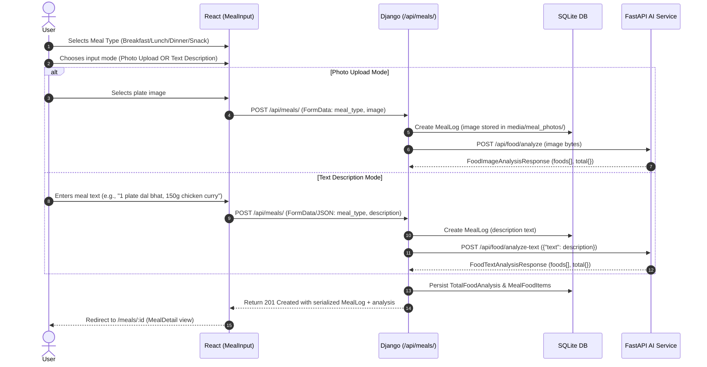
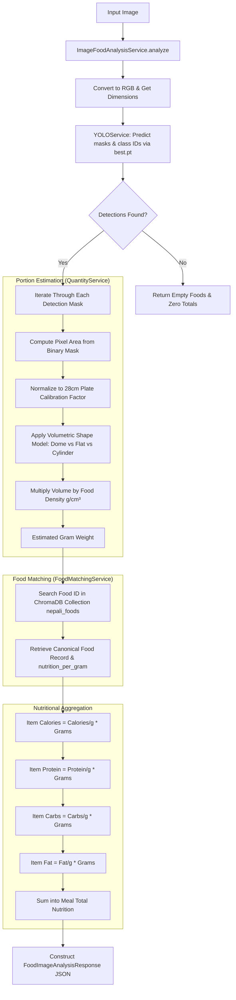
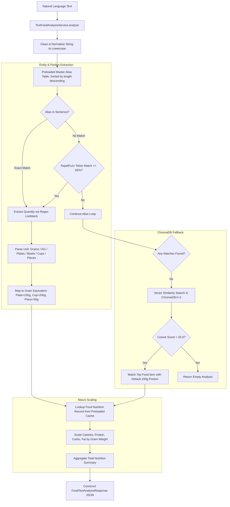
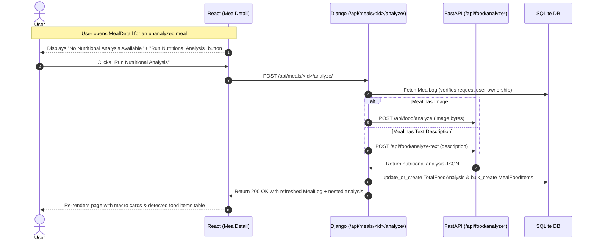
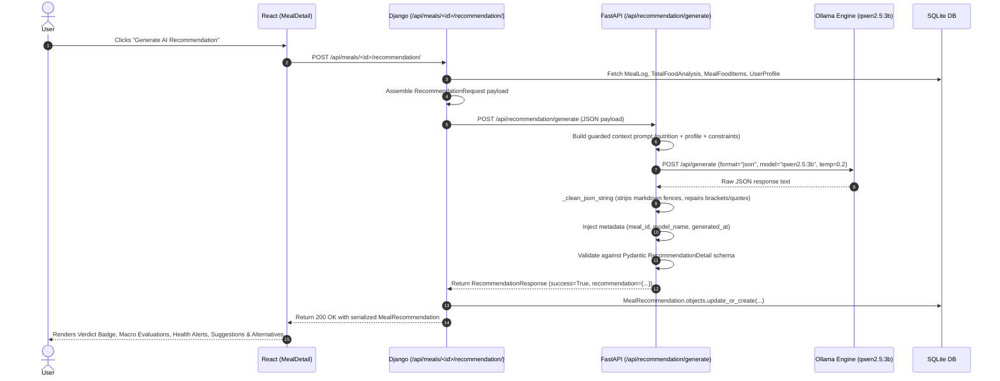
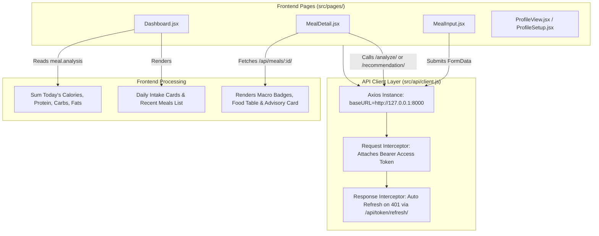
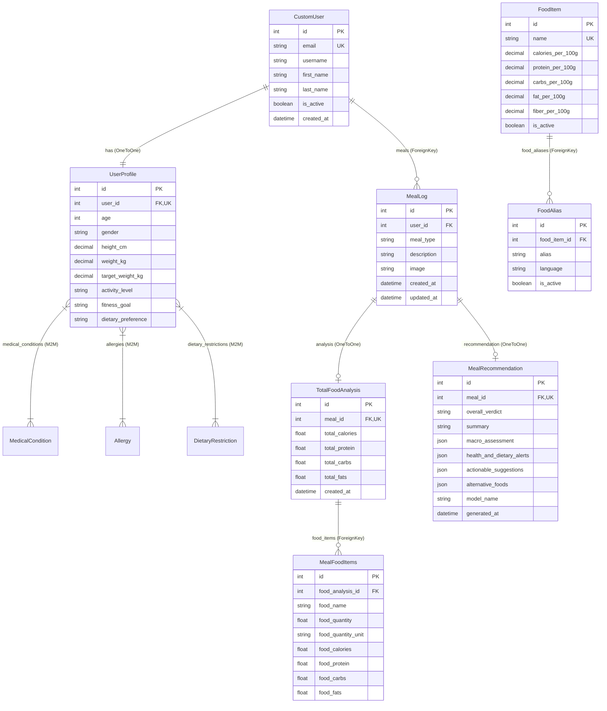
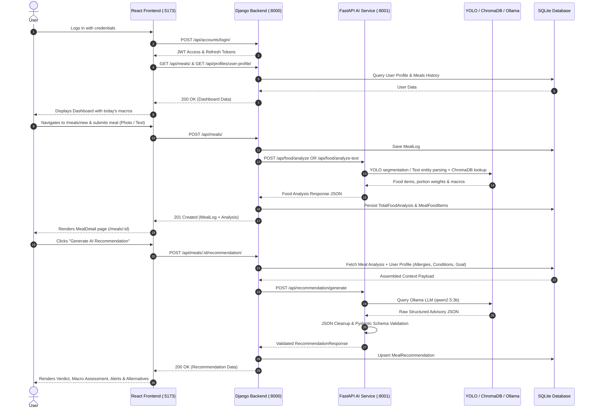

# System Workflow & Architecture Documentation

**Nepali Lifestyle-Based Diet and Fitness Advisory System**

This document provides a comprehensive technical reference for the current system architecture, service workflows, data flows, and component responsibilities as implemented in the codebase.

---

## Table of Contents

1. [System Overview](#1-system-overview)
2. [High-Level Architecture](#2-high-level-architecture)
3. [Component Responsibilities](#3-component-responsibilities)
4. [Meal Logging Workflow](#4-meal-logging-workflow)
5. [Image-Based Analysis Workflow](#5-image-based-analysis-workflow)
6. [Text-Based Analysis Workflow](#6-text-based-analysis-workflow)
7. [Nutritional Analysis Persistence](#7-nutritional-analysis-persistence)
8. [Nutritional Analysis Recovery Workflow](#8-nutritional-analysis-recovery-workflow)
9. [AI Recommendation Workflow](#9-ai-recommendation-workflow)
10. [Recommendation Persistence & Regeneration](#10-recommendation-persistence--regeneration)
11. [Frontend Data Flow](#11-frontend-data-flow)
12. [Django ↔ FastAPI Communication](#12-django--fastapi-communication)
13. [ChromaDB Vector Matching Layer](#13-chromadb-vector-matching-layer)
14. [YOLOv8 Instance Segmentation Subsystem](#14-yolov8-instance-segmentation-subsystem)
15. [Ollama Local LLM Subsystem](#15-ollama-local-llm-subsystem)
16. [Database Schema & Entity Relationships](#16-database-schema--entity-relationships)
17. [API Endpoint Specifications](#17-api-endpoint-specifications)
18. [Error Handling & Service Dependencies](#18-error-handling--service-dependencies)
19. [Complete End-to-End Workflow Diagram](#19-complete-end-to-end-workflow-diagram)
20. [Current Implementation Boundaries](#20-current-implementation-boundaries)

---

## 1. System Overview

The **Nepali Lifestyle-Based Diet and Fitness Advisory System** is a multi-service web application designed to track meals and generate culturally authentic, personalized dietary advice for Nepali users.

The system addresses the limitations of conventional dietary platforms, which are calibrated around Western food composition databases and fail to recognize indigenous Nepali dishes (*Dal Bhat*, *Dhindo*, *Gundruk*, *Chiura*, *Tarkari*, *Achar*), religious eating constraints (such as *vrat* fasting or pure vegetarian preferences), and regional cooking styles.

### Core Capabilities
- **Dual-Mode Meal Ingestion**: Accepts top-down plate photographs or natural language text descriptions (in English or Romanized Nepali).
- **Automated Food Segmentation & Portion Sizing**: Identifies individual dishes using a fine-tuned YOLOv8 model and estimates gram weight using a 28 cm plate geometric volume model.
- **Semantic Food Matching**: Maps localized/colloquial food names to canonical nutritional records using ChromaDB vector similarity search.
- **Macronutrient Computation**: Computes exact itemized and aggregated nutritional totals (Calories, Protein, Carbohydrates, Fats).
- **Guarded AI Dietary Advisory**: Leverages a local LLM (Ollama `qwen2.5:3b`) with strict prompt constraints, JSON repair mechanisms, and Pydantic validation to provide clinical alerts, macro evaluations, and Nepali food alternative suggestions.

---

## 2. High-Level Architecture

The system is organized into four distinct, loosely coupled layers:

```
+--------------------------------------------------------------------------+
|                            React Frontend                                |
|        (Vite + React 19 + Tailwind CSS v4 + React Hook Form)             |
+------------------------------------+-------------------------------------+
                                     |  HTTP / REST (Axios + JWT)
                                     v
+--------------------------------------------------------------------------+
|                         Django REST Backend                              |
|   - Authentication & Identity Management (CustomUser)                    |
|   - Health Profiles, Medical Conditions, Allergies, Restrictions        |
|   - Media Storage (meal_photos/)                                         |
|   - Persistence: MealLog, TotalFoodAnalysis, MealFoodItems               |
|   - Persistence: MealRecommendation                                      |
|   - SQLite Database (db.sqlite3)                                         |
+------------------------------------+-------------------------------------+
                                     |  Internal HTTP (httpx Client)
                                     v
+--------------------------------------------------------------------------+
|                         FastAPI AI Service                               |
|   +--------------------------+    +----------------------------------+   |
|   | Image Pipeline           |    | Text Pipeline                    |   |
|   | - YOLOv8 (best.pt)       |    | - Alias Index & RapidFuzz        |   |
|   | - QuantityService (28cm) |    | - Regex Portion Unit Parsing     |   |
|   +------------+-------------+    +----------------+-----------------+   |
|                |                                   |                     |
|                +-----------------+-----------------+                     |
|                                  v                                       |
|                   +------------------------------+                       |
|                   | ChromaDB Vector Store        |                       |
|                   | (nepali_foods Collection)    |                       |
|                   | multilingual-MiniLM-L12-v2   |                       |
|                   +--------------+---------------+                       |
|                                  |                                       |
|                                  v                                       |
|                   +------------------------------+                       |
|                   | Recommendation Engine        |                       |
|                   | - Guarded Context Prompt     |                       |
|                   | - Ollama (qwen2.5:3b)        |                       |
|                   | - JSON Repair & Validation   |                       |
|                   +------------------------------+                       |
+--------------------------------------------------------------------------+
```

---

## 3. Component Responsibilities

The system strictly enforces separation of concerns across its architectural boundaries:

| Component | Technology | Primary Responsibilities | Strict Invariants |
|---|---|---|---|
| **Frontend** | React 19, Vite, Tailwind CSS | UI presentation, user input capture (photos & text), authenticated API interaction, rendering charts and structured advisory data. | **Never** computes nutritional totals or generates dietary advice. |
| **Main Backend** | Django 6.0, Django REST Framework | User authentication (JWT), profile management, meal persistence, database transactions, context assembly for AI, and endpoint routing. | Serves as the single source of truth for application state; bridges React to FastAPI. |
| **AI Microservice** | FastAPI, Pydantic v2 | Executes image segmentation, geometric portion modeling, text entity parsing, vector similarity matching, and LLM prompt orchestration. | Stateless; does not maintain direct database connections or user identity. |
| **Vector Store** | ChromaDB | Stores high-dimensional embeddings of Nepali food names and aliases for semantic similarity lookup. | Used strictly for entity matching; is not an LLM and does not generate advisory text. |
| **Object Detection** | YOLOv8 (Ultralytics) | Detects individual food boundaries and produces segmentation masks from plate photos. | Outputs raw geometry and classification labels; does not calculate nutrition. |
| **Local LLM Engine** | Ollama (`qwen2.5:3b`) | Generates structured dietary recommendations based on persisted nutrition totals and user health profiles. | **Never** calculates nutritional numbers; receives pre-computed macros as immutable facts. |
| **Database** | SQLite (`db.sqlite3`) | Stores user credentials, profiles, medical lookups, meal logs, food analyses, and AI recommendations. | Managed exclusively by Django ORM. |

---

## 4. Meal Logging Workflow

Users can record meals using either a top-down food photograph or a natural language text description.



---

## 5. Image-Based Analysis Workflow

When an image is submitted, the FastAPI image pipeline processes the image through several stages:



### Key Technical Parameters:
- **Plate Normalization**: Assumes a standard plate diameter of $28.0\text{ cm}$. Pixel diameter is calculated as $\min(\text{height}, \text{width}) \times 0.85$.
- **Food Shapes & Densities**:
  - *Bhat* (Rice): Density $0.75\text{ g/cm}^3$, dome shape factor $0.6$, average height $3.5\text{ cm}$.
  - *Dal* (Lentil soup): Density $1.05\text{ g/cm}^3$, cylindrical shape factor $1.0$, average height $4.0\text{ cm}$.
  - *Sabji* (Vegetables): Density $0.90\text{ g/cm}^3$, flat shape factor $1.0$, average height $2.0\text{ cm}$.
  - Default fallback: Density $0.85\text{ g/cm}^3$, flat shape factor $1.0$, average height $2.0\text{ cm}$.

---

## 6. Text-Based Analysis Workflow

The text food analysis service processes natural language meal descriptions without requiring visual input:



---

## 7. Nutritional Analysis Persistence

Once the FastAPI service responds with structured nutritional data, Django persists the results using transactional ORM operations:

```mermaid
flowchart LR
    A[FastAPI Analysis Response] --> B[Django: analyze_meal_image / analyze_meal_text]
    B --> C[TotalFoodAnalysis.objects.update_or_create]
    C --> D[Save: total_calories, total_protein, total_carbs, total_fats]
    D --> E[total_analysis.food_items.all.delete]
    E --> F[MealFoodItems.objects.bulk_create]
    F --> G[Persist each food_name, food_quantity, unit, calories, protein, carbs, fats]
    G --> H[meal.refresh_from_db]
```



This guarantees that:
- Every meal log has at most one associated `TotalFoodAnalysis` record (`OneToOneField`).
- Previous food item line items are atomically replaced upon re-analysis.
- Downstream services (such as recommendation generation or daily dashboard aggregation) read directly from persisted database records.

---

## 8. Nutritional Analysis Recovery Workflow

If the AI service is offline, temporarily unreachable, or times out during the initial meal logging step, the system gracefully saves the `MealLog` without analysis. Users can trigger analysis recovery at any point.



---

## 9. AI Recommendation Workflow

Dietary recommendation generation is an independent, on-demand step that operates on top of persisted nutritional analysis and user profile data.



---

## 10. Recommendation Persistence & Regeneration

- **One-to-One Binding**: Each `MealLog` is linked to at most one `MealRecommendation` record via `OneToOneField(MealLog, related_name="recommendation")`.
- **Idempotent Regeneration**: Calling `POST /api/meals/<id>/recommendation/` multiple times executes an `update_or_create` operation on the existing recommendation record, updating its fields and timestamp rather than duplicating records.
- **Direct Retrieval**: Calling `GET /api/meals/<id>/recommendation/` returns the already persisted recommendation without triggering new LLM inference.
- **Persisted Fields**:
  - `overall_verdict`: `OPTIMAL`, `ALIGNED`, `MODERATELY_ALIGNED`, `NEEDS_IMPROVEMENT`, or `RESTRICTED`.
  - `summary`: One-sentence executive evaluation.
  - `macro_assessment`: Detailed JSON mapping of individual macro evaluations (Calories, Protein, Carbs, Fats).
  - `health_and_dietary_alerts`: List of alert objects (`type`, `severity`, `message`).
  - `actionable_suggestions`: Array of practical recommendations for the Nepali diet.
  - `alternative_foods`: Array of substitution recommendations (`recommended_food`, `replaces`, `reason`).
  - `model_name`: Model identifier string (e.g., `qwen2.5:3b`).
  - `generated_at`: ISO timestamp of recommendation creation.

---

## 11. Frontend Data Flow



---

## 12. Django ↔ FastAPI Communication

All inter-service communication between Django and FastAPI is handled through `backend/core/ai_service/client.py` using `httpx`:

```python
# Internal Service Configuration
AI_SERVICE_URL = getattr(settings, "AI_SERVICE_URL", "http://127.0.0.1:8001")
```

### Communication Interface:
1. `check_ai_service_health() -> dict`:
   - Endpoint: `GET {AI_SERVICE_URL}/health` (timeout: `5.0s`)
2. `analyze_food(image_file) -> dict`:
   - Endpoint: `POST {AI_SERVICE_URL}/api/food/analyze` (multipart `image`, timeout: `60.0s`)
3. `analyze_food_text(text: str) -> dict`:
   - Endpoint: `POST {AI_SERVICE_URL}/api/food/analyze-text` (JSON `{"text": text}`, timeout: `30.0s`)
4. `generate_recommendation(payload: dict) -> dict`:
   - Endpoint: `POST {AI_SERVICE_URL}/api/recommendation/generate` (JSON payload, timeout: `300.0s`)

---

## 13. ChromaDB Vector Matching Layer

ChromaDB acts as the high-dimensional similarity index for mapping detected food labels and natural language phrases to canonical food items.

- **Storage Location**: `ai-service/chroma_db/`
- **Collection Name**: `nepali_foods`
- **Embedding Model**: `sentence-transformers/paraphrase-multilingual-MiniLM-L12-v2` via `langchain-huggingface`
- **Master Dataset**: `ai-service/data/master_database.json`
- **Embedded Document Content**:
  ```text
  Food name: <name>
  Food ID: <id>
  Other names and aliases: <alias_1>, <alias_2>, ...
  ```
- **Stored Metadata**: `id`, `name`, `other_names` (JSON string), `veg_or_nonveg`, `fitness_direction`, `nutrition_per_gram` (JSON string), `health_restrictions` (JSON string), `social_restrictions` (JSON string).
- **Generation Script**: `ai-service/scripts/generate_embedding.py` builds the vector store idempotently from `master_database.json`.

---

## 14. YOLOv8 Instance Segmentation Subsystem

- **Service Module**: `ai-service/app/services/yolo_service.py`
- **Weights File**: `ai-service/models/yolo/best.pt`
- **Model Engine**: Ultralytics YOLOv8 instance segmentation (`YOLO(model_path)`)
- **Inference Configuration**:
  - `conf=0.25`: Filters predictions with confidence below 25%.
  - `result.masks`: Extracts binary polygon mask tensors.
  - `result.boxes.cls`: Extracts detected class indices.
  - `result.boxes.conf`: Extracts confidence scores.
- **Output Data Structure**:
  ```python
  {
      "class_id": int,
      "name": str,
      "confidence": float,
      "mask": np.ndarray  # Binary mask array
  }
  ```

---

## 15. Ollama Local LLM Subsystem

- **Service Module**: `ai-service/app/services/recommendation_service.py`
- **Default Base URL**: `http://localhost:11434` (`OLLAMA_BASE_URL`)
- **Default Model**: `qwen2.5:3b` (`OLLAMA_MODEL`)
- **Inference Parameters**:
  - `stream`: `False`
  - `format`: `"json"`
  - `temperature`: `0.2`
  - `top_p`: `0.9`
  - `num_predict`: `380`
- **JSON Sanitization & Repair Engine**:
  - Strips markdown code blocks (````json ... ````).
  - Isolates substring starting at the first `{`.
  - Analyzes quote balance and automatically closes open quotes.
  - Balances unmatched open square brackets (`[`) and curly braces (`{`).
  - Validates output against Pydantic schema `RecommendationDetail`.

---

## 16. Database Schema & Entity Relationships

The relational data model is managed by Django using SQLite:



---

## 17. API Endpoint Specifications

### Django REST Framework Endpoints (`http://127.0.0.1:8000`)

| Method | Route | Auth | Payload / Parameters | Description |
|---|---|---|---|---|
| `POST` | `/api/accounts/register/` | None | `{email, password, first_name, last_name}` | Creates user and returns JWT token pair. |
| `POST` | `/api/accounts/login/` | None | `{email, password}` | Authenticates user; returns tokens and profile info. |
| `POST` | `/api/token/` | None | `{email, password}` | SimpleJWT token pair generator. |
| `POST` | `/api/token/refresh/` | None | `{refresh}` | Returns new access token. |
| `GET` | `/api/profiles/user-profile/` | JWT | None | Fetches authenticated user's profile. |
| `POST` | `/api/profiles/user-profile/` | JWT | Profile JSON schema | Creates profile questionnaire. |
| `PATCH`| `/api/profiles/user-profile/` | JWT | Partial profile JSON | Updates profile metrics and preferences. |
| `GET` | `/api/profiles/medical-conditions/` | JWT | None | Lists master medical conditions. |
| `GET` | `/api/profiles/allergies/` | JWT | None | Lists master allergy choices. |
| `GET` | `/api/profiles/dietary-restrictions/` | JWT | None | Lists master dietary/fasting restrictions. |
| `GET` | `/api/meals/` | JWT | None | Lists all meal logs of the user with nested analysis. |
| `POST` | `/api/meals/` | JWT | FormData (`meal_type`, optional `image`, `description`) | Creates meal log and triggers AI analysis. |
| `GET` | `/api/meals/<id>/` | JWT | None | Fetches specific meal log with analysis and recommendation. |
| `PATCH`| `/api/meals/<id>/` | JWT | FormData | Updates meal log (re-triggers analysis if photo/text changed). |
| `DELETE`| `/api/meals/<id>/` | JWT | None | Deletes meal log and associated records. |
| `POST` | `/api/meals/<id>/analyze/` | JWT | None | Manually triggers or re-triggers nutritional analysis via FastAPI. |
| `GET` | `/api/meals/<id>/recommendation/` | JWT | None | Retrieves existing AI recommendation for the meal. |
| `POST` | `/api/meals/<id>/recommendation/` | JWT | None | Generates/regenerates recommendation via FastAPI/Ollama and saves to DB. |
| `GET` | `/api/nutrition/foods/` | JWT | Query `?search=...` | Lists active food items and aliases. |
| `GET` | `/api/nutrition/foods/<id>/` | JWT | None | Retrieves single food item nutrition data. |

---

### FastAPI Endpoints (`http://127.0.0.1:8001`)

| Method | Route | Request Body | Response Model | Description |
|---|---|---|---|---|
| `GET` | `/health` | None | `{"status": "healthy", ...}` | Health check probe. |
| `POST` | `/api/food/analyze` | `multipart/form-data` (`image`) | `FoodImageAnalysisResponse` | Segments food plate photo with YOLO, estimates portion weights, matches ChromaDB, returns macros. |
| `POST` | `/api/food/analyze-text` | `{"text": string}` | `FoodTextAnalysisResponse` | Extracts dishes and quantities from natural text, matches ChromaDB, returns macros. |
| `POST` | `/api/recommendation/generate` | `RecommendationRequest` JSON | `RecommendationResponse` | Constructs prompt, runs Ollama LLM, validates output schema, returns advisory JSON. |

---

## 18. Error Handling & Service Dependencies

### Service Dependency Hierarchy

```
React UI (:5173)
  └── Django REST API (:8000)
        └── FastAPI AI Service (:8001)
              ├── YOLO Segmentation (models/yolo/best.pt)
              ├── ChromaDB Vector Store (chroma_db/)
              └── Ollama Local Server (:11434 / qwen2.5:3b)
```

### Graceful Degradation Behaviors:
1. **FastAPI AI Service Offline during Meal Creation**:
   - Django catches `httpx.RequestError`, logs the error, and completes saving the `MealLog`.
   - The user is redirected to the `MealDetail` page, where the UI indicates that nutritional analysis is pending and displays a "Run Nutritional Analysis" recovery button.
2. **FastAPI AI Service Offline during Recommendation Generation**:
   - Django catches the error and returns `502 Bad Gateway` with a descriptive message.
   - The React frontend displays an error banner with an inline "Retry" button without affecting the displayed nutritional values.
3. **Ollama Service Offline or Unresponsive**:
   - FastAPI catches `httpx.ConnectError` or `httpx.TimeoutException` (timeout configured to `300.0s`).
   - FastAPI raises an HTTP `503 Service Unavailable` or `504 Gateway Timeout` with guidance to start Ollama.
4. **Malformed LLM Output**:
   - `_clean_json_string` repairs unclosed brackets, braces, and trailing truncated tokens.
   - If output fails Pydantic schema validation, FastAPI raises a `502 Bad Gateway` error preventing corrupted data from entering the database.

---

## 19. Complete End-to-End Workflow Diagram



---

## 20. Current Implementation Boundaries

- **Single Active Development Database**: The project currently uses local SQLite (`db.sqlite3`) managed via Django migrations.
- **Synchronous AI Service Invocations**: Django invokes FastAPI synchronously via `httpx` timeouts; no external task queues (e.g., Celery/Redis) are currently configured.
- **Local Model Execution**: YOLO weights (`best.pt`), ChromaDB (`nepali_foods`), and Ollama (`qwen2.5:3b`) execute locally on the host machine.
- **Scope of Guidance**: The system provides lifestyle and cultural dietary advisory guidance for wellness and personal tracking; it is explicitly not a clinical diagnostic tool.